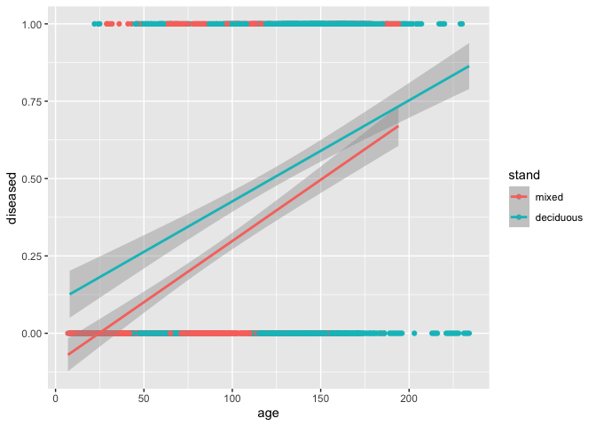
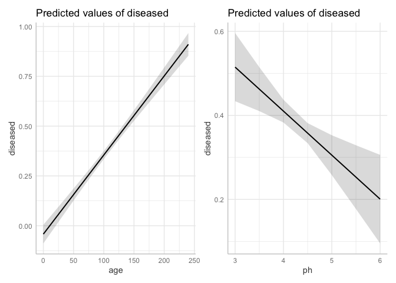
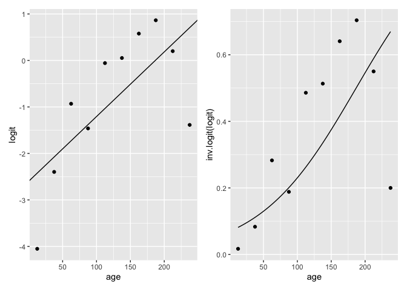
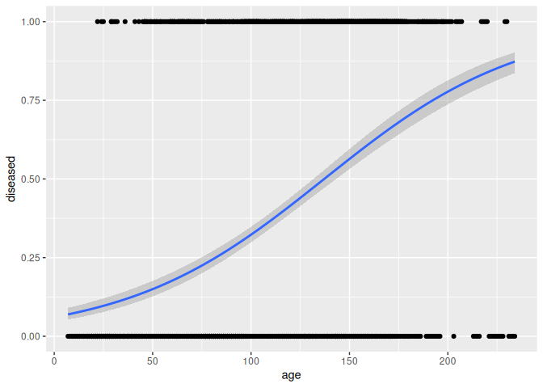
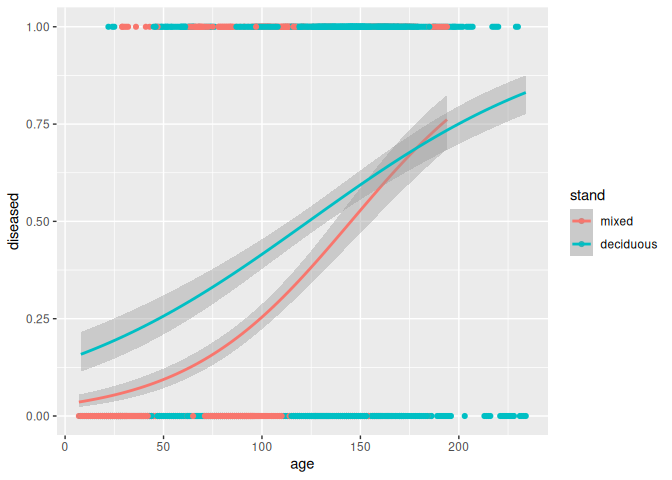
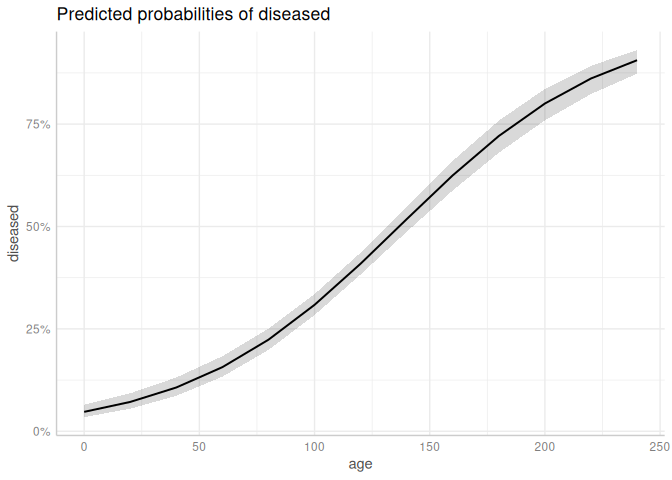
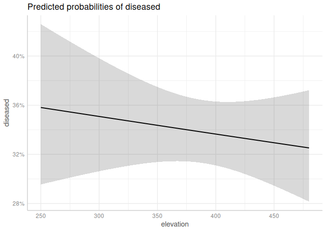
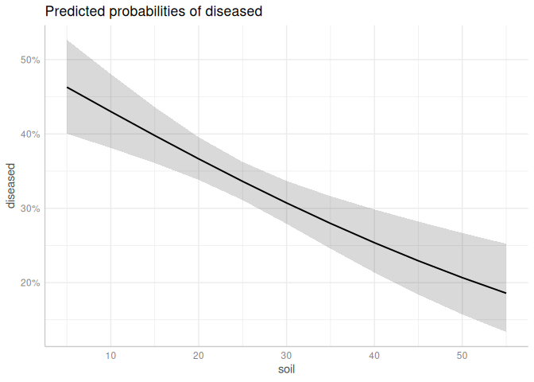

Research Seminar - Logistic Regression
================
Kai & Johannes

- [1 Preamble](#1-preamble)
- [2 Introduction](#2-introduction)
- [3 Data: `ForestHealth`](#3-data-foresthealth)
- [4 Orinary LM vs. GLM](#4-orinary-lm-vs-glm)
- [5 Logistic regression](#5-logistic-regression)
  - [5.1 Theoretical background](#51-theoretical-background)
  - [5.2 Developing a GLM by hand](#52-developing-a-glm-by-hand)
  - [5.3 Model diagnostics](#53-model-diagnostics)
  - [5.4 Model interpretaion](#54-model-interpretaion)
  - [5.5 PhD examples](#55-phd-examples)
- [6 Literature and Material](#6-literature-and-material)
  - [6.1 Primary literature](#61-primary-literature)
  - [6.2 Online resources](#62-online-resources)
  - [6.3 Books](#63-books)

# 1 Preamble

This README file serves as an outline of today’s topics and contains or
links to all materials required. This file and all materials can be
found on github. Today’s aims are

- to have a loot at the type of **data** for which a logistic regression
  can be performed and
- to discuss one of the most relevant examples for which logistic
  regression are often used. On the basis of this example,
- we take a deeper look the special **properties** of the logistic
  regression and thereby repeat the concept of generalized regression
  and
- **perform and interpret** a logistic regression in `R`.
- At the end, 2 short examples from **current research projects** are
  presented and discussed.

The martial contains contents, ideas and examples from the textbook
Fahrmeir et al. (2013) as well as parts as from the associated lecture
series `GLM` by Professor Thomas Kneib, Chair of Statistics.
Furthermore, parts of the lectures `Statistical Data Analysis with R`
and `Advanced Statistical Programming` of the forest faculty are
included. We ask you to prepare some tasks beforehand to save some time
in the seminar. Those are tagged as **Beforehand task**.

We are using the following libraries:

``` r
library(tidyverse)  # Data science
library(ggplot2)    # Visualization
library(boot)       # For logit() and inv.logit()

# GLM itself is part of the stats package, which is loaded at start up
library(ggeffects)  # Visual interpretation of statistical models
library(emmeans)    # Testing linear hypotheses
```

**Beforehand task 0:** Getting ready

- Connect to the repository and clone it to your laptop
- Get R and R Studio running
- Install the required libraries

# 2 Introduction

Modelling survival probabilities, also known as survival analysis, is
one of the most important and most suitable purposes for which logistic
regression is used and which we will use as an example today. (Another
widely used field of application is the analysis of questionnaires,
which will be sketched in the PhD examples at the end.) The specialty of
survival data is that the response variable can only have binary (or
more generally categorical) outcomes. The individuals survive until a
certain point in time occurs, or more generally, until a certain event
occurs. The simplest models only contain the time, i.e. the age of the
individuals. They give the average unconditional probability of
survival. More complex models can take multiple aspects into account.
The idea of survival modelling is to estimate this event and possibly
additionally inference the reasons survival (or non-survival
respectively). This 0/1 property is the reason, why the values of the
response that are to be estimated have different outcomes than the
observations of the response variable. In logistic regression, not the
outcome of an observation $y_i$ (e.g. dead or alive) is estimated, but
the **probability that an observation shows an outcome**, a fundamental
contrast to ordinary linear regression. Logistic regression is a
possibility to fit a survival probability curve over a continuous
variable of interest, e.g. the tree age. Fact for the economists:
Logistic regression is thus an alternative to the well-known Weibull
survival curves. The regression curve has similar properties as the
cumulative Weibull distribution and the the interpretation is
comparable. Simply spoken, the advantage of Weibull-function is the
straightforward parameter interpretation. Logistic regression comes more
from the field of statistical inference and thus has more
straightforward test procedures (multiple variable selection, linear
hypotheses, quality of fit, …) and is easy to estimate (in terms of
programming and also technically).

# 3 Data: `ForestHealth`

Consider the example data set `ForestHealth` from Fahrmeir et
al. (2013). The data set consists of 16 variables with 1796 observations
on forest health to identify potential factors influencing the health
status of trees and therefore the vital status of the forest. The data
in our example come from a project in the forest of Rothenbuch
(Spessart), which has been carried out by Axel Göttlein (Technical
University, Munich) since 1982. Five tree species are part of this
survey: beech, oak, spruce, larch, and pine. Here we will restrict
ourselves to beech trees. Every year, the condition of beech trees is
categorized by three ordinal categories \[0 % - 12.5), \[12.5 % - 50 %),
and \[50 % - 75 %). The forth category \>75 % is not captured in the
data. The category 0 % signifies that the beech tree is healthy, the
category 100 % implies that the tree is dead. See Fahrmeir et al. (2013,
p. 9) for more details.

**Beforehand Task 1:** Getting familiar with the data and with the
nature of binary responses

- Load `ForestHealth`, rename to `fh`
- Create a binary response variable that contains healthy (defoliation
  \[0 % - 12.5)) and unhealthy (\[12.5 % - 75 %)) trees
- Perform relevant descriptive statistics to get an overview
- Which variables might have an impact on the tree health?
- Fit an ordinary linear model `lm` to estimate the health status over
  the age
- Add **one** another variable that seems to influence the tree health
  - Are these two models suitable to estimate the health status? Give
    some pro and contra arguments and underpin your arguments using
    common numbers or diagrams of (linear) statistical inference.

``` r
# Loading ForestHealth
load("Data/ForestHealth.rda")

fh <- ForestHealth

# Creating the binary variable diseased (0 = healthy, 1 = diseased)
fh <- fh %>% mutate(diseased = ifelse(defoliation %in% "[0, 12.5)", 0, 1))

# Overview
summary(fh)
```

    ##        id             year          defoliation         x         
    ##  Min.   : 1.00   Min.   :1983   [0, 12.5) :1113   Min.   : 0.700  
    ##  1st Qu.:21.00   1st Qu.:1988   [12.5, 50): 629   1st Qu.: 3.700  
    ##  Median :42.00   Median :1994   [50, 75]  :  51   Median : 8.100  
    ##  Mean   :41.71   Mean   :1994                     Mean   : 7.448  
    ##  3rd Qu.:62.00   3rd Qu.:1999                     3rd Qu.:10.300  
    ##  Max.   :83.00   Max.   :2004                     Max.   :16.100  
    ##        y              age            canopy        inclination      elevation  
    ##  Min.   :0.400   Min.   :  7.0   Min.   :0.0000   Min.   : 0.00   Min.   :250  
    ##  1st Qu.:2.100   1st Qu.: 65.0   1st Qu.:0.7000   1st Qu.: 6.00   1st Qu.:340  
    ##  Median :3.000   Median :112.0   Median :0.9000   Median :14.00   Median :390  
    ##  Mean   :3.306   Mean   :106.2   Mean   :0.7731   Mean   :15.45   Mean   :387  
    ##  3rd Qu.:4.100   3rd Qu.:148.0   3rd Qu.:1.0000   3rd Qu.:21.00   3rd Qu.:440  
    ##  Max.   :9.000   Max.   :234.0   Max.   :1.0000   Max.   :46.00   Max.   :480  
    ##       soil             ph                            moisture         alkali   
    ##  Min.   : 9.00   Min.   :3.280   moderately dry          :198   very low :352  
    ##  1st Qu.:16.00   1st Qu.:4.100   moderately moist        :989   low      :988  
    ##  Median :23.00   Median :4.250   moist or temporarily wet:606   high     :308  
    ##  Mean   :24.63   Mean   :4.295                                  very high:145  
    ##  3rd Qu.:31.00   3rd Qu.:4.440                                                 
    ##  Max.   :51.00   Max.   :6.050                                                 
    ##         humus           stand     fertilized    diseased     
    ##  [0cm, 1cm]:973   mixed    :891   no :1450   Min.   :0.0000  
    ##  (1cm, 2cm]:387   deciduous:902   yes: 343   1st Qu.:0.0000  
    ##  (2cm, 3cm]:266                              Median :0.0000  
    ##  (3cm, 4cm]:118                              Mean   :0.3793  
    ##  (4cm, 9cm]: 49                              3rd Qu.:1.0000  
    ##                                              Max.   :1.0000

``` r
# Linear model
fh %>% ggplot(aes(y = diseased, x = age)) + geom_point() +
  geom_smooth(method = "lm")
```

    ## `geom_smooth()` using formula = 'y ~ x'

<!-- -->

``` r
lm_simple <- fh %>% lm(diseased ~ age, data = .)
summary(lm_simple)
```

    ## 
    ## Call:
    ## lm(formula = diseased ~ age, data = .)
    ## 
    ## Residuals:
    ##     Min      1Q  Median      3Q     Max 
    ## -0.8864 -0.3389 -0.1009  0.4270  0.9547 
    ## 
    ## Coefficients:
    ##               Estimate Std. Error t value Pr(>|t|)    
    ## (Intercept) -0.0419314  0.0238913  -1.755   0.0794 .  
    ## age          0.0039671  0.0002026  19.584   <2e-16 ***
    ## ---
    ## Signif. codes:  0 '***' 0.001 '**' 0.01 '*' 0.05 '.' 0.1 ' ' 1
    ## 
    ## Residual standard error: 0.4406 on 1791 degrees of freedom
    ## Multiple R-squared:  0.1764, Adjusted R-squared:  0.1759 
    ## F-statistic: 383.5 on 1 and 1791 DF,  p-value: < 2.2e-16

``` r
# Multiple linear model: Age, stand
lm_multiple_1 <- fh %>% select(diseased, age, stand) %>%  lm(diseased ~ ., data = .)
summary(lm_multiple_1)
```

    ## 
    ## Call:
    ## lm(formula = diseased ~ ., data = .)
    ## 
    ## Residuals:
    ##     Min      1Q  Median      3Q     Max 
    ## -0.8985 -0.3299 -0.1047  0.4162  0.9596 
    ## 
    ## Coefficients:
    ##               Estimate Std. Error t value Pr(>|t|)    
    ## (Intercept) -0.0008312  0.0247395  -0.034    0.973    
    ## age          0.0035764  0.0002120  16.869  < 2e-16 ***
    ## standmixed  -0.0625172  0.0108900  -5.741  1.1e-08 ***
    ## ---
    ## Signif. codes:  0 '***' 0.001 '**' 0.01 '*' 0.05 '.' 0.1 ' ' 1
    ## 
    ## Residual standard error: 0.4367 on 1790 degrees of freedom
    ## Multiple R-squared:  0.1913, Adjusted R-squared:  0.1904 
    ## F-statistic: 211.7 on 2 and 1790 DF,  p-value: < 2.2e-16

``` r
fh %>% ggplot(aes(y = diseased, x = age, col = stand)) + geom_point() +
  geom_smooth(method = "lm")
```

    ## `geom_smooth()` using formula = 'y ~ x'

<!-- -->

``` r
# Multiple linear model: Age, ph
lm_multiple_2 <- fh %>% select(diseased, age, ph) %>%  lm(diseased ~ ., data = .)
summary(lm_multiple_2)
```

    ## 
    ## Call:
    ## lm(formula = diseased ~ ., data = .)
    ## 
    ## Residuals:
    ##      Min       1Q   Median       3Q      Max 
    ## -0.88023 -0.35707 -0.09575  0.43448  1.03082 
    ## 
    ## Coefficients:
    ##              Estimate Std. Error t value Pr(>|t|)    
    ## (Intercept)  0.407705   0.134845   3.024  0.00253 ** 
    ## age          0.003969   0.000202  19.648  < 2e-16 ***
    ## ph          -0.104735   0.030916  -3.388  0.00072 ***
    ## ---
    ## Signif. codes:  0 '***' 0.001 '**' 0.01 '*' 0.05 '.' 0.1 ' ' 1
    ## 
    ## Residual standard error: 0.4393 on 1790 degrees of freedom
    ## Multiple R-squared:  0.1816, Adjusted R-squared:  0.1807 
    ## F-statistic: 198.6 on 2 and 1790 DF,  p-value: < 2.2e-16

``` r
# Marginal effects
p1 <- ggeffects::ggeffect(lm_multiple_2, terms = "age") %>% plot()
p2 <- ggeffects::ggeffect(lm_multiple_2, terms = "ph") %>% plot()

library(patchwork)

p1 + p2
```

<!-- -->

# 4 Orinary LM vs. GLM

Why is the ordinary linear models usually not suited to model binary
responses (and under which conditions could a linear model might be
sufficient)? Consider the results from task 1 and elaborate the question
further in task 2.

**Beforehand Task 2:** What is the difference between linear models and
general linear models? What adds the G to LM?

- Read Lane (2002) and prepare for the following discussion:
  - Why do generalized linear model belong to the family of linear
    models even though their curvature is not linear?
  - Which properties distinguish a *generalized linear model* from a
    *linear* model? In particular: What is a link function?
  - Which properties distinguish a *generalized linear model* from a
    *non-linear* model?

# 5 Logistic regression

The GLM philosphy is explained directly using the example of logistic
regression. Generally, in contrast to LMs, GLMs have a link function and
allow arbitrary assumptions to be made about the residual distribution.
Other existing differences are not included.

## 5.1 Theoretical background

Instead of modelling $y_i$ directly, we define a regression model that
estimates the possibility of a discrete status 1 (e.g. diseased)

$$
\pi_i=\text{E}(y_i)=P(y_i=1),
$$

where $\pi_i$ shall vary continuously between 0 and 1 even tough $y_i$
is discrete. To achieve $\pi_i \in[0, 1]$, we apply a transformation (in
the sense of Lane (2002)) that transforms (“links”) the linear
regression formula to the deserved properties. The linear regression
formula (so to speak the linear core of the GLM)

$$
\eta_i=\beta_0+\beta_1 x_{i1}+ \dots + \beta_k x_{ik}
$$

is called linear predictor. Binomial regression requires a more
sophisticated transformation than the log-normal regression performed in
Lane (2002). However, the principle is the same.

$$
\pi_i=h(\eta_i).
$$

Along with some less familiar transformations, the logit transformation
leads to the desired properties of survival analysis, which is why the
binomial is sometimes referred to as logit regression. The term logistic
regression comes from the logistic (s shape) curvature that follows from
the logit transformation (In this sense, Weibull functions, Bertalanffy
growth functions and any other s shaped regression curves are also
logistic regressions). The logit response function $h$ relies on the
logistic cumulative distribution function

$$
\pi=h(\eta)=\frac{\text{exp}(\eta)}{1+\text{exp}(\eta)}.
$$

The respective inverse, also called link function $h$ reads as

$$
g(\pi)=\text{log} \left( \frac{\pi}{1 - \pi}\ \right).
$$

The response function follows a Bernoulli distribution. However,
grouping observation with same outcomes makes the solving process more
efficient and then leads to a Binomial distribution (Fahrmeir et al.,
2023, p. 270 - 277), which is why in practiced programming, the Binomial
or Quasibinomial distributions are usually taken. You should stick to
these standard combination of distributions of link functions, however,
you can freely decide for any of the distributions of the so called
exponential family if you know what you do.

## 5.2 Developing a GLM by hand

We want to develop the principle of the link function by a
self-programmed data transformation. Let’s start simple. We firstly
calculate the mean disease probability in the data set without any
covariates (even without `age`). Straightforward calculation is to
calculate the ratio of successes (diseased trees) in relation to all
trees as

``` r
sum(fh$diseased) / nrow(fh)
```

    ## [1] 0.3792526

``` r
mean(fh$diseased)
```

    ## [1] 0.3792526

``` r
# A linear model
#m1 <- lm(diseased ~ 1, data = fh)
#coef(m1)
# @Johannes, das kann weg oder? Das ist nicht anschlussfähig, da das später ja nicht mehr geht. Verwirrt nur?!
```

Another option, which is seemingly so straightforward at the moment, is
to calculate an intercept only logistic regression.

``` r
# GLM
glm_intercept_only <- glm(diseased ~ 1, family = binomial(), data = fh)
```

Result (prediction) is the average disease probability. Additionally, we
get the prediction of the link function. Generally, the GLM output
provides predictions for the response, the original scale. In Lane
(2002), this response was $y_o=\beta_0 \beta_1^{x_1}$. The link,
respectively, provides estimations on the scale of the linear predictor
(here, the logit, in Lane the log). Applying the inverse of the logit
function `exp(x)/(1+exp(x))` to the prediction of the link thus, again,
gives the response.

``` r
predict(glm_intercept_only, type = "response")[1]
```

    ##         1 
    ## 0.3792526

``` r
(x <- predict(glm_intercept_only, type = "link")[1])
```

    ##          1 
    ## -0.4927216

``` r
exp(x) / (1+exp(x))
```

    ##         1 
    ## 0.3792526

Analogously to Lane (2002), we can also calculate the logits by hand (we
transform the data). Still for the case of a simple population mean, we
get

``` r
(p <- mean(fh$diseased))
```

    ## [1] 0.3792526

``` r
log(p / (1 - p))# logit(p)
```

    ## [1] -0.4927216

``` r
inv.logit(logit(p)) # short for exp(x) / (1+exp(x))
```

    ## [1] 0.3792526

Further developing the model, we now define groups of mixture type
`stand` with differing disease probabilities:

``` r
# Firstly, the GLM considering one categorical variable
glm_stand <- glm(diseased ~ stand, family = binomial(), data = fh)
summary(glm_stand)
```

    ## 
    ## Call:
    ## glm(formula = diseased ~ stand, family = binomial(), data = fh)
    ## 
    ## Coefficients:
    ##             Estimate Std. Error z value Pr(>|z|)    
    ## (Intercept) -0.53077    0.05077  -10.45   <2e-16 ***
    ## standmixed  -0.53077    0.05077  -10.45   <2e-16 ***
    ## ---
    ## Signif. codes:  0 '***' 0.001 '**' 0.01 '*' 0.05 '.' 0.1 ' ' 1
    ## 
    ## (Dispersion parameter for binomial family taken to be 1)
    ## 
    ##     Null deviance: 2380  on 1792  degrees of freedom
    ## Residual deviance: 2266  on 1791  degrees of freedom
    ## AIC: 2270
    ## 
    ## Number of Fisher Scoring iterations: 4

``` r
# Again, we fetch disease probabilities for the real scale (response) and
# for the logit-transformed scale (link) 

nd <- data.frame(stand = c("deciduous", "mixed"))
predict(glm_stand, nd, type = "response")
```

    ##         1         2 
    ## 0.5000000 0.2570146

``` r
predict(glm_stand, nd, type = "link")
```

    ##             1             2 
    ##  1.620926e-14 -1.061544e+00

``` r
inv.logit(predict(glm_stand, nd, type = "link")) # gives the link
```

    ##         1         2 
    ## 0.5000000 0.2570146

``` r
# @Johannes: Weg oder?

# A linear model does no longer work
#m2 <- lm(diseased ~ stand, data = fh)
#coef(m2)
```

And now the promised data transformation:

``` r
# Do the logit transformation by hand ...
d1 <- data.frame(
  stand = c("mixed", "deciduous"), 
  logit = table(fh$stand, fh$diseased) |> 
    apply(1, function(x) x[2] / sum(x)) |> 
    logit()
)
d1
```

    ##               stand     logit
    ## mixed         mixed -1.061544
    ## deciduous deciduous  0.000000

``` r
# ... and then estimate an ordinary linear model.
m3 <- lm(logit ~ stand, data = d1)
coef(m3)
```

    ##   (Intercept)    standmixed 
    ## -7.850462e-17 -1.061544e+00

``` r
# Backtransformation gives us the same group means as the GLM.
inv.logit(coef(m3))
```

    ## (Intercept)  standmixed 
    ##   0.5000000   0.2570146

Interim interpretation: Just as in logarithmic regression, logistic
regression performs a “in-model” transformation. Doing data
transformation to linearize the data leads (in this example) to the same
results. Now let’s derive the typical disease model, modelling the
disease probability over age. We thus add a continuous variable `age`.
Any observation can be 0 or 1 only, we thus cannot calculate $p$ for the
observations. A problem that not yet occurred (not in Lane (2002), not
in our simpler disease models). We need to define groups with at least 2
observations to get $p$. Best would be to have multiple observations for
each age, which is, however, not likely for continuous variables. We
thus need to define intervals of ages.

``` r
cut(fh$age, breaks = seq(20, 240, 20)) # 20-year-age-groups
```

    ##    [1] (40,60]   (40,60]   (40,60]   (40,60]   (40,60]   (40,60]   (40,60]  
    ##    [8] (40,60]   (40,60]   (40,60]   (40,60]   (40,60]   (40,60]   (40,60]  
    ##   [15] (40,60]   (40,60]   (40,60]   (40,60]   (60,80]   (60,80]   (60,80]  
    ##   [22] (60,80]   (100,120] (100,120] (100,120] (100,120] (100,120] (120,140]
    ##   [29] (120,140] (120,140] (120,140] (120,140] (120,140] (120,140] (120,140]
    ##   [36] (120,140] (120,140] (120,140] (120,140] (120,140] (120,140] (120,140]
    ##   [43] (120,140] (120,140] <NA>      <NA>      <NA>      <NA>      (20,40]  
    ##   [50] (20,40]   (20,40]   (20,40]   (20,40]   (20,40]   (20,40]   (20,40]  
    ##   [57] (20,40]   (20,40]   (20,40]   (20,40]   (20,40]   (20,40]   (20,40]  
    ##   [64] (20,40]   (20,40]   (20,40]   (60,80]   (60,80]   (60,80]   (60,80]  
    ##   [71] (60,80]   (60,80]   (80,100]  (80,100]  (80,100]  (80,100]  (80,100] 
    ##   [78] (80,100]  (80,100]  (80,100]  (80,100]  (80,100]  (80,100]  (80,100] 
    ##   [85] (80,100]  (80,100]  (80,100]  (80,100]  (40,60]   (40,60]   (40,60]  
    ##   [92] (40,60]   (40,60]   (40,60]   (40,60]   (40,60]   (40,60]   (40,60]  
    ##   [99] (40,60]   (40,60]   (40,60]   (40,60]   (60,80]   (60,80]   (60,80]  
    ##  [106] (60,80]   (60,80]   (60,80]   (60,80]   (60,80]   (20,40]   (20,40]  
    ##  [113] (20,40]   (20,40]   (20,40]   (20,40]   (20,40]   (40,60]   (40,60]  
    ##  [120] (40,60]   (40,60]   (40,60]   (40,60]   (40,60]   (40,60]   (40,60]  
    ##  [127] (40,60]   (40,60]   (40,60]   (40,60]   (40,60]   (40,60]   (140,160]
    ##  [134] (140,160] (140,160] (140,160] (140,160] (140,160] (140,160] (140,160]
    ##  [141] (140,160] (140,160] (140,160] (140,160] (140,160] (140,160] (140,160]
    ##  [148] (140,160] (140,160] (140,160] (160,180] (160,180] (160,180] (160,180]
    ##  [155] (100,120] (100,120] (100,120] (100,120] (100,120] (100,120] (100,120]
    ##  [162] (100,120] (120,140] (120,140] (120,140] (120,140] (120,140] (120,140]
    ##  [169] (120,140] (120,140] (120,140] (120,140] (120,140] (120,140] (120,140]
    ##  [176] (120,140] (80,100]  (80,100]  (80,100]  (80,100]  (80,100]  (80,100] 
    ##  [183] (80,100]  (80,100]  (80,100]  (80,100]  (80,100]  (80,100]  (80,100] 
    ##  [190] (80,100]  (80,100]  (80,100]  (80,100]  (80,100]  (80,100]  (100,120]
    ##  [197] (100,120] (100,120] (140,160] (140,160] (140,160] (140,160] (160,180]
    ##  [204] (160,180] (160,180] (160,180] (160,180] (160,180] (160,180] (160,180]
    ##  [211] (160,180] (160,180] (160,180] (160,180] (160,180] (160,180] (160,180]
    ##  [218] (160,180] (160,180] (160,180] (140,160] (140,160] (140,160] (140,160]
    ##  [225] (160,180] (160,180] (160,180] (160,180] (160,180] (160,180] (160,180]
    ##  [232] (160,180] (160,180] (160,180] (160,180] (160,180] (160,180] (160,180]
    ##  [239] (160,180] (160,180] (160,180] (160,180] (120,140] (120,140] (120,140]
    ##  [246] (120,140] (120,140] (120,140] (120,140] (120,140] (120,140] (140,160]
    ##  [253] (140,160] (140,160] (140,160] (140,160] (140,160] (140,160] (140,160]
    ##  [260] (140,160] (140,160] (140,160] (140,160] (140,160] (40,60]   (40,60]  
    ##  [267] (40,60]   (40,60]   (40,60]   (40,60]   (40,60]   (40,60]   (40,60]  
    ##  [274] (40,60]   (40,60]   (40,60]   (40,60]   (40,60]   (40,60]   (40,60]  
    ##  [281] (40,60]   (40,60]   (40,60]   (60,80]   (60,80]   (60,80]   (20,40]  
    ##  [288] (20,40]   (20,40]   (40,60]   (40,60]   (40,60]   (40,60]   (40,60]  
    ##  [295] (40,60]   (40,60]   (40,60]   (40,60]   (40,60]   (40,60]   (40,60]  
    ##  [302] (40,60]   (40,60]   (40,60]   (40,60]   (40,60]   (40,60]   (40,60]  
    ##  [309] (120,140] (120,140] (120,140] (120,140] (120,140] (120,140] (120,140]
    ##  [316] (120,140] (120,140] (120,140] (140,160] (140,160] (140,160] (140,160]
    ##  [323] (140,160] (140,160] (140,160] (140,160] (140,160] (140,160] (140,160]
    ##  [330] (140,160] (80,100]  (80,100]  (80,100]  (80,100]  (80,100]  (80,100] 
    ##  [337] (80,100]  (80,100]  (80,100]  (80,100]  (80,100]  (80,100]  (80,100] 
    ##  [344] (80,100]  (80,100]  (80,100]  (80,100]  (80,100]  (80,100]  (100,120]
    ##  [351] (100,120] (100,120] (120,140] (120,140] (120,140] (120,140] (120,140]
    ##  [358] (120,140] (120,140] (120,140] (120,140] (120,140] (120,140] (120,140]
    ##  [365] (120,140] (120,140] (140,160] (140,160] (140,160] (140,160] (140,160]
    ##  [372] (140,160] (140,160] (140,160] (120,140] (120,140] (120,140] (120,140]
    ##  [379] (120,140] (120,140] (120,140] (120,140] (120,140] (120,140] (120,140]
    ##  [386] (120,140] (120,140] (120,140] (140,160] (140,160] (140,160] (140,160]
    ##  [393] (140,160] (140,160] (140,160] (140,160] (80,100]  (80,100]  (80,100] 
    ##  [400] (80,100]  (80,100]  (80,100]  (80,100]  (80,100]  (80,100]  (80,100] 
    ##  [407] (80,100]  (80,100]  (80,100]  (80,100]  (80,100]  (80,100]  (80,100] 
    ##  [414] (100,120] (100,120] (100,120] (100,120] (100,120] (140,160] (140,160]
    ##  [421] (140,160] (140,160] (140,160] (140,160] (140,160] (140,160] (140,160]
    ##  [428] (140,160] (140,160] (140,160] (140,160] (140,160] (140,160] (140,160]
    ##  [435] (140,160] (140,160] (160,180] (160,180] (160,180] (160,180] (40,60]  
    ##  [442] (40,60]   (60,80]   (60,80]   (60,80]   (60,80]   (60,80]   (60,80]  
    ##  [449] (60,80]   (60,80]   (60,80]   (60,80]   (60,80]   (60,80]   (60,80]  
    ##  [456] (60,80]   (60,80]   (60,80]   (60,80]   (60,80]   (60,80]   (60,80]  
    ##  [463] (20,40]   (20,40]   (40,60]   (40,60]   (40,60]   (40,60]   (40,60]  
    ##  [470] (40,60]   (40,60]   (40,60]   (40,60]   (40,60]   (40,60]   (40,60]  
    ##  [477] (40,60]   (40,60]   (40,60]   (40,60]   (40,60]   (40,60]   (40,60]  
    ##  [484] (40,60]   <NA>      <NA>      (20,40]   (20,40]   (20,40]   (20,40]  
    ##  [491] (20,40]   (20,40]   (20,40]   (20,40]   (20,40]   (20,40]   (20,40]  
    ##  [498] (120,140] (120,140] (120,140] (120,140] (120,140] (140,160] (140,160]
    ##  [505] (140,160] (140,160] (140,160] (140,160] (140,160] (140,160] (140,160]
    ##  [512] (140,160] (140,160] (140,160] (140,160] (140,160] (140,160] (140,160]
    ##  [519] (140,160] (20,40]   (20,40]   (20,40]   (20,40]   (20,40]   (20,40]  
    ##  [526] (20,40]   (20,40]   (20,40]   (20,40]   (20,40]   (20,40]   (20,40]  
    ##  [533] (20,40]   (40,60]   (40,60]   (40,60]   (40,60]   (40,60]   (40,60]  
    ##  [540] (40,60]   (40,60]   (120,140] (120,140] (140,160] (140,160] (140,160]
    ##  [547] (140,160] (140,160] (140,160] (140,160] (140,160] (140,160] (140,160]
    ##  [554] (140,160] (140,160] (140,160] (140,160] (140,160] (140,160] (140,160]
    ##  [561] (140,160] (140,160] (140,160] (180,200] (180,200] (180,200] (180,200]
    ##  [568] (180,200] (180,200] (180,200] (180,200] (180,200] (180,200] (180,200]
    ##  [575] (180,200] (180,200] (180,200] (180,200] (200,220] (200,220] (200,220]
    ##  [582] (200,220] (200,220] (200,220] (200,220] (60,80]   (60,80]   (60,80]  
    ##  [589] (60,80]   (60,80]   (60,80]   (60,80]   (60,80]   (60,80]   (60,80]  
    ##  [596] (80,100]  (80,100]  (80,100]  (80,100]  (80,100]  (80,100]  (80,100] 
    ##  [603] (80,100]  (80,100]  (80,100]  (80,100]  (80,100]  (60,80]   (60,80]  
    ##  [610] (60,80]   (60,80]   (60,80]   (60,80]   (60,80]   (60,80]   (60,80]  
    ##  [617] (60,80]   (60,80]   (60,80]   (60,80]   (60,80]   (60,80]   (60,80]  
    ##  [624] (60,80]   (80,100]  (80,100]  (80,100]  (80,100]  (80,100]  (120,140]
    ##  [631] (120,140] (120,140] (120,140] (140,160] (140,160] (140,160] (140,160]
    ##  [638] (140,160] (140,160] (140,160] (140,160] (140,160] (140,160] (140,160]
    ##  [645] (140,160] (140,160] (140,160] (140,160] (140,160] (140,160] (140,160]
    ##  [652] (60,80]   (60,80]   (60,80]   (60,80]   (60,80]   (60,80]   (60,80]  
    ##  [659] (60,80]   (60,80]   (60,80]   (60,80]   (80,100]  (80,100]  (80,100] 
    ##  [666] (80,100]  (80,100]  (80,100]  (80,100]  (80,100]  (80,100]  (80,100] 
    ##  [673] (80,100]  (20,40]   (20,40]   (20,40]   (20,40]   (20,40]   (20,40]  
    ##  [680] (20,40]   (20,40]   (20,40]   (20,40]   (20,40]   (20,40]   (20,40]  
    ##  [687] (20,40]   (20,40]   (20,40]   (20,40]   (20,40]   (20,40]   (20,40]  
    ##  [694] (40,60]   (40,60]   (120,140] (120,140] (120,140] (120,140] (120,140]
    ##  [701] (120,140] (120,140] (120,140] (120,140] (120,140] (140,160] (140,160]
    ##  [708] (140,160] (140,160] (140,160] (140,160] (140,160] (140,160] (140,160]
    ##  [715] (140,160] (140,160] (140,160] (120,140] (120,140] (120,140] (120,140]
    ##  [722] (120,140] (120,140] (120,140] (120,140] (120,140] (120,140] (120,140]
    ##  [729] (120,140] (140,160] (140,160] (140,160] (140,160] (140,160] (140,160]
    ##  [736] (140,160] (140,160] (140,160] (140,160] (60,80]   (60,80]   (60,80]  
    ##  [743] (60,80]   (60,80]   (60,80]   (60,80]   (60,80]   (60,80]   (60,80]  
    ##  [750] (60,80]   (60,80]   (60,80]   (60,80]   (80,100]  (80,100]  (80,100] 
    ##  [757] (80,100]  (80,100]  (80,100]  (80,100]  (80,100]  (100,120] (100,120]
    ##  [764] (100,120] (100,120] (100,120] (100,120] (100,120] (120,140] (120,140]
    ##  [771] (120,140] (120,140] (120,140] (120,140] (120,140] (120,140] (120,140]
    ##  [778] (120,140] (120,140] (120,140] (120,140] (120,140] (120,140] (140,160]
    ##  [785] (140,160] (140,160] (140,160] (140,160] (140,160] (140,160] (140,160]
    ##  [792] (140,160] (140,160] (140,160] (140,160] (140,160] (140,160] (140,160]
    ##  [799] (140,160] (140,160] (140,160] (140,160] (140,160] (160,180] (160,180]
    ##  [806] (100,120] (100,120] (100,120] (100,120] (100,120] (100,120] (100,120]
    ##  [813] (100,120] (120,140] (120,140] (120,140] (120,140] (120,140] (120,140]
    ##  [820] (120,140] (120,140] (120,140] (120,140] (120,140] (120,140] (120,140]
    ##  [827] (120,140] (60,80]   (60,80]   (60,80]   (60,80]   (60,80]   (60,80]  
    ##  [834] (60,80]   (80,100]  (80,100]  (80,100]  (80,100]  (80,100]  (80,100] 
    ##  [841] (80,100]  (80,100]  (80,100]  (80,100]  (80,100]  (80,100]  (80,100] 
    ##  [848] (80,100]  (80,100]  (100,120] (100,120] (100,120] (100,120] (100,120]
    ##  [855] (100,120] (100,120] (100,120] (100,120] (100,120] (100,120] (120,140]
    ##  [862] (120,140] (120,140] (120,140] (120,140] (120,140] (120,140] (120,140]
    ##  [869] (120,140] (120,140] (120,140] (120,140] (120,140] (120,140] (120,140]
    ##  [876] (120,140] (120,140] (120,140] (120,140] (120,140] (120,140] (120,140]
    ##  [883] (120,140] (120,140] (120,140] (120,140] (120,140] (140,160] (140,160]
    ##  [890] (140,160] (140,160] (140,160] (140,160] (80,100]  (80,100]  (80,100] 
    ##  [897] (80,100]  (80,100]  (80,100]  (80,100]  (80,100]  (80,100]  (80,100] 
    ##  [904] (100,120] (100,120] (100,120] (100,120] (100,120] (100,120] (100,120]
    ##  [911] (100,120] (100,120] (100,120] (100,120] (100,120] (80,100]  (80,100] 
    ##  [918] (80,100]  (80,100]  (80,100]  (80,100]  (100,120] (100,120] (100,120]
    ##  [925] (100,120] (100,120] (100,120] (100,120] (100,120] (100,120] (100,120]
    ##  [932] (100,120] (100,120] (100,120] (100,120] (100,120] (100,120] <NA>     
    ##  [939] <NA>      <NA>      <NA>      <NA>      <NA>      <NA>      <NA>     
    ##  [946] <NA>      <NA>      <NA>      <NA>      <NA>      (20,40]   (20,40]  
    ##  [953] (20,40]   (20,40]   (20,40]   (20,40]   (20,40]   (20,40]   (20,40]  
    ##  [960] (20,40]   (20,40]   (20,40]   (20,40]   (20,40]   (20,40]   (20,40]  
    ##  [967] (20,40]   (20,40]   (20,40]   (20,40]   (20,40]   (20,40]   (20,40]  
    ##  [974] (20,40]   (40,60]   (40,60]   (40,60]   (40,60]   (40,60]   (40,60]  
    ##  [981] (40,60]   (140,160] (140,160] (140,160] (160,180] (160,180] (160,180]
    ##  [988] (160,180] (160,180] (160,180] (160,180] (160,180] (160,180] (160,180]
    ##  [995] (160,180] (160,180] (160,180] (160,180] (160,180] (160,180] (160,180]
    ## [1002] (160,180] (160,180] (160,180] (160,180] (160,180] (160,180] (180,200]
    ## [1009] (180,200] (180,200] (180,200] (180,200] (180,200] (180,200] (180,200]
    ## [1016] (180,200] (180,200] (180,200] (180,200] (180,200] (180,200] (180,200]
    ## [1023] (180,200] (180,200] (180,200] (180,200] (180,200] (180,200] (180,200]
    ## [1030] (180,200] (180,200] (180,200] (180,200] (180,200] (180,200] (180,200]
    ## [1037] <NA>      <NA>      <NA>      <NA>      <NA>      <NA>      <NA>     
    ## [1044] <NA>      <NA>      <NA>      <NA>      (100,120] (100,120] (100,120]
    ## [1051] (100,120] (100,120] (100,120] (100,120] (100,120] (100,120] (100,120]
    ## [1058] (100,120] (100,120] (100,120] (100,120] (100,120] (100,120] (100,120]
    ## [1065] (100,120] (100,120] (100,120] (120,140] (120,140] (100,120] (100,120]
    ## [1072] (100,120] (100,120] (100,120] (100,120] (100,120] (100,120] (100,120]
    ## [1079] (100,120] (100,120] (120,140] (120,140] (120,140] (120,140] (120,140]
    ## [1086] (120,140] (120,140] (120,140] (120,140] (120,140] (120,140] (140,160]
    ## [1093] (140,160] (140,160] (140,160] (140,160] (140,160] (140,160] (160,180]
    ## [1100] (160,180] (160,180] (160,180] (160,180] (160,180] (160,180] (160,180]
    ## [1107] (160,180] (160,180] (160,180] (160,180] (160,180] (160,180] (160,180]
    ## [1114] (60,80]   (60,80]   (60,80]   (60,80]   (80,100]  (80,100]  (80,100] 
    ## [1121] (80,100]  (80,100]  (80,100]  (80,100]  (80,100]  (80,100]  (80,100] 
    ## [1128] (80,100]  (80,100]  (80,100]  (80,100]  (80,100]  (80,100]  (80,100] 
    ## [1135] (80,100]  (40,60]   (40,60]   (40,60]   (40,60]   (40,60]   (40,60]  
    ## [1142] (40,60]   (40,60]   (40,60]   (40,60]   (40,60]   (40,60]   (40,60]  
    ## [1149] (40,60]   (40,60]   (40,60]   (40,60]   (40,60]   (40,60]   (60,80]  
    ## [1156] (60,80]   (60,80]   (100,120] (100,120] (100,120] (100,120] (100,120]
    ## [1163] (100,120] (100,120] (100,120] (100,120] (100,120] (100,120] (100,120]
    ## [1170] (100,120] (100,120] (100,120] (100,120] (120,140] (120,140] (120,140]
    ## [1177] (120,140] (120,140] (120,140] <NA>      <NA>      <NA>      (20,40]  
    ## [1184] (20,40]   (20,40]   (20,40]   (20,40]   (20,40]   (20,40]   (20,40]  
    ## [1191] (20,40]   (20,40]   (20,40]   <NA>      <NA>      <NA>      <NA>     
    ## [1198] <NA>      <NA>      <NA>      <NA>      <NA>      <NA>      (20,40]  
    ## [1205] (20,40]   (20,40]   (20,40]   (20,40]   (20,40]   (20,40]   (20,40]  
    ## [1212] (20,40]   (20,40]   (20,40]   (20,40]   (20,40]   (20,40]   (20,40]  
    ## [1219] (20,40]   (20,40]   (20,40]   (20,40]   (20,40]   (20,40]   (20,40]  
    ## [1226] (20,40]   (20,40]   (20,40]   (20,40]   (20,40]   (20,40]   (20,40]  
    ## [1233] (20,40]   (20,40]   (20,40]   (40,60]   (40,60]   (140,160] (140,160]
    ## [1240] (140,160] (140,160] (140,160] (160,180] (160,180] (160,180] (160,180]
    ## [1247] (160,180] (160,180] (160,180] (160,180] (160,180] (160,180] (160,180]
    ## [1254] (160,180] (160,180] (160,180] (160,180] (160,180] (160,180] <NA>     
    ## [1261] <NA>      <NA>      <NA>      <NA>      <NA>      <NA>      <NA>     
    ## [1268] <NA>      <NA>      <NA>      <NA>      <NA>      (20,40]   (20,40]  
    ## [1275] (20,40]   (20,40]   (20,40]   (20,40]   (20,40]   (20,40]   (20,40]  
    ## [1282] (120,140] (120,140] (120,140] (120,140] (120,140] (120,140] (120,140]
    ## [1289] (120,140] (120,140] (120,140] (120,140] (120,140] (120,140] (120,140]
    ## [1296] (140,160] (140,160] (140,160] (140,160] (140,160] (140,160] (140,160]
    ## [1303] (140,160] (60,80]   (60,80]   (60,80]   (60,80]   (60,80]   (60,80]  
    ## [1310] (60,80]   (60,80]   (60,80]   (60,80]   (60,80]   (60,80]   (60,80]  
    ## [1317] (60,80]   (60,80]   (60,80]   (60,80]   (60,80]   (60,80]   (60,80]  
    ## [1324] (80,100]  (80,100]  <NA>      (20,40]   (20,40]   (20,40]   (20,40]  
    ## [1331] (20,40]   (20,40]   (20,40]   (20,40]   (20,40]   (20,40]   (20,40]  
    ## [1338] (20,40]   (20,40]   (20,40]   (20,40]   (20,40]   (20,40]   (20,40]  
    ## [1345] (20,40]   (20,40]   (40,60]   (140,160] (140,160] (140,160] (140,160]
    ## [1352] (140,160] (140,160] (140,160] (140,160] (140,160] (140,160] (140,160]
    ## [1359] (140,160] (140,160] (140,160] (140,160] (140,160] (140,160] (140,160]
    ## [1366] (160,180] (160,180] (160,180] (160,180] (140,160] (140,160] (140,160]
    ## [1373] (140,160] (140,160] (140,160] (140,160] (140,160] (160,180] (160,180]
    ## [1380] (160,180] (160,180] (160,180] (160,180] (160,180] (160,180] (160,180]
    ## [1387] (160,180] (160,180] (160,180] (160,180] (160,180] (140,160] (140,160]
    ## [1394] (140,160] (140,160] (140,160] (140,160] (140,160] (160,180] (160,180]
    ## [1401] (160,180] (160,180] (160,180] (160,180] (160,180] (160,180] (160,180]
    ## [1408] (160,180] (160,180] (160,180] (160,180] (160,180] (160,180] (60,80]  
    ## [1415] (60,80]   (80,100]  (80,100]  (80,100]  (80,100]  (80,100]  (80,100] 
    ## [1422] (80,100]  (80,100]  (80,100]  (80,100]  (80,100]  (80,100]  (80,100] 
    ## [1429] (80,100]  (80,100]  (80,100]  (80,100]  (80,100]  (80,100]  (80,100] 
    ## [1436] (100,120] (100,120] (100,120] (100,120] (100,120] (100,120] (100,120]
    ## [1443] (100,120] (100,120] (100,120] (120,140] (120,140] (120,140] (120,140]
    ## [1450] (120,140] (120,140] (120,140] (120,140] (120,140] (120,140] (120,140]
    ## [1457] (120,140] (80,100]  (80,100]  (80,100]  (80,100]  (80,100]  (100,120]
    ## [1464] (100,120] (100,120] (100,120] (100,120] (100,120] (100,120] (100,120]
    ## [1471] (100,120] (100,120] (100,120] (100,120] (100,120] (100,120] (100,120]
    ## [1478] (100,120] (100,120] (140,160] (140,160] (160,180] (160,180] (160,180]
    ## [1485] (160,180] (160,180] (160,180] (160,180] (160,180] (160,180] (160,180]
    ## [1492] (160,180] (160,180] (160,180] (160,180] (160,180] (160,180] (160,180]
    ## [1499] (160,180] (160,180] (160,180] (140,160] (140,160] (160,180] (160,180]
    ## [1506] (160,180] (160,180] (160,180] (160,180] (160,180] (160,180] (160,180]
    ## [1513] (160,180] (160,180] (160,180] (160,180] <NA>      <NA>      <NA>     
    ## [1520] <NA>      (20,40]   (20,40]   (20,40]   (80,100]  (80,100]  (80,100] 
    ## [1527] (80,100]  (80,100]  (80,100]  (80,100]  (80,100]  (80,100]  (80,100] 
    ## [1534] (80,100]  (80,100]  (80,100]  (80,100]  (100,120] (100,120] (100,120]
    ## [1541] (100,120] (100,120] (100,120] (100,120] (100,120] (120,140] (120,140]
    ## [1548] (120,140] (120,140] (120,140] (120,140] (120,140] (120,140] (120,140]
    ## [1555] (140,160] (140,160] (140,160] (140,160] (140,160] (140,160] (140,160]
    ## [1562] (140,160] (140,160] (140,160] (140,160] (140,160] (140,160] (140,160]
    ## [1569] (140,160] (140,160] (140,160] (140,160] (140,160] (140,160] (140,160]
    ## [1576] (140,160] (140,160] (140,160] (160,180] (160,180] (160,180] (160,180]
    ## [1583] (160,180] (160,180] (160,180] (160,180] (160,180] (160,180] (160,180]
    ## [1590] (140,160] (140,160] (140,160] (140,160] (140,160] (140,160] (140,160]
    ## [1597] (140,160] (140,160] (140,160] (140,160] (140,160] (140,160] (140,160]
    ## [1604] (140,160] (140,160] (140,160] (140,160] (160,180] (160,180] (160,180]
    ## [1611] (160,180] (100,120] (100,120] (100,120] (100,120] (100,120] (100,120]
    ## [1618] (120,140] (120,140] (120,140] (120,140] (120,140] (120,140] (120,140]
    ## [1625] (120,140] (120,140] (120,140] (120,140] (120,140] (120,140] (120,140]
    ## [1632] (120,140] (120,140] (60,80]   (60,80]   (60,80]   (60,80]   (60,80]  
    ## [1639] (60,80]   (60,80]   (60,80]   (60,80]   (60,80]   (60,80]   (60,80]  
    ## [1646] (60,80]   (60,80]   (60,80]   (60,80]   (60,80]   (60,80]   (60,80]  
    ## [1653] (80,100]  (80,100]  (80,100]  (140,160] (140,160] (140,160] (140,160]
    ## [1660] <NA>      <NA>      <NA>      <NA>      <NA>      <NA>      <NA>     
    ## [1667] <NA>      <NA>      <NA>      <NA>      <NA>      <NA>      (20,40]  
    ## [1674] (20,40]   (20,40]   (20,40]   (20,40]   (20,40]   (20,40]   (20,40]  
    ## [1681] (20,40]   (20,40]   (20,40]   (20,40]   (200,220] (200,220] (200,220]
    ## [1688] (200,220] (200,220] (200,220] (200,220] (200,220] (220,240] (220,240]
    ## [1695] (220,240] (220,240] (220,240] (220,240] (220,240] (220,240] (220,240]
    ## [1702] (220,240] (220,240] (220,240] (220,240] (220,240] (40,60]   (40,60]  
    ## [1709] (40,60]   (40,60]   (40,60]   (40,60]   (60,80]   (60,80]   (60,80]  
    ## [1716] (60,80]   (60,80]   (60,80]   (60,80]   (60,80]   (60,80]   (60,80]  
    ## [1723] (60,80]   (60,80]   (60,80]   (60,80]   (60,80]   (60,80]   (160,180]
    ## [1730] (160,180] (160,180] (160,180] (160,180] (160,180] (160,180] (160,180]
    ## [1737] (160,180] (160,180] (160,180] (160,180] (160,180] (160,180] (160,180]
    ## [1744] (160,180] (160,180] (180,200] (180,200] (180,200] (180,200] (180,200]
    ## [1751] (60,80]   (60,80]   (60,80]   (60,80]   (60,80]   (80,100]  (80,100] 
    ## [1758] (80,100]  (80,100]  (80,100]  (80,100]  (80,100]  (80,100]  (80,100] 
    ## [1765] (80,100]  (80,100]  (80,100]  (80,100]  (80,100]  (80,100]  (80,100] 
    ## [1772] (80,100]  (60,80]   (60,80]   (60,80]   (60,80]   (60,80]   (60,80]  
    ## [1779] (60,80]   (60,80]   (60,80]   (60,80]   (60,80]   (60,80]   (60,80]  
    ## [1786] (60,80]   (60,80]   (60,80]   (80,100]  (80,100]  (80,100]  (80,100] 
    ## [1793] (80,100] 
    ## 11 Levels: (20,40] (40,60] (60,80] (80,100] (100,120] (120,140] ... (220,240]

``` r
d <- fh |> mutate(g = age - (age %% 25)) |> 
  group_by(g) |> 
  summarize(logit = logit(mean(diseased))) |> # Calc. logits for groups
  mutate(age = g + 12.5)

head(d)
```

    ## # A tibble: 6 × 3
    ##       g   logit   age
    ##   <dbl>   <dbl> <dbl>
    ## 1     0 -4.05    12.5
    ## 2    25 -2.40    37.5
    ## 3    50 -0.931   62.5
    ## 4    75 -1.46    87.5
    ## 5   100 -0.0566 112. 
    ## 6   125  0.0531 138.

``` r
self_tailored_glm_age <- lm(logit ~ age, data = d) # Fit a linear regression through the logits
coef(self_tailored_glm_age)
```

    ## (Intercept)         age 
    ##  -2.5979539   0.0139126

The logit-transformed data is indeed linear (more or less) and the
back-transformed regression function shows indeed an s-shaped curve that
looks familiar.

``` r
p1 <- d %>% ggplot(aes(y = logit, x = age)) + geom_point() + geom_abline(intercept = coef(self_tailored_glm_age)["(Intercept)"],
                                                                   slope = coef(self_tailored_glm_age)["age"])
# @Johannes, da hab ich was falsch verstanden... 
p2 <- d %>% ggplot(aes(y = inv.logit(logit), x = age)) + geom_point() + geom_function(fun = function (x) {exp(2.59795 + 0.01391 * x) / (1 + exp(2.59795 + 0.01391 * x))})

p1 + p2
```

<!-- -->

``` r
glm_age <- glm(diseased ~ age, data = fh, family = binomial(link = "logit"))
coef(glm_age)
```

    ## (Intercept)         age 
    ## -2.73169128  0.01991347

``` r
nd <- data.frame(age = c(10, 50, 100))
predict(self_tailored_glm_age, nd)
```

    ##         1         2         3 
    ## -2.458828 -1.902324 -1.206694

``` r
predict(glm_age, nd)
```

    ##          1          2          3 
    ## -2.5325565 -1.7360175 -0.7403438

``` r
predict(self_tailored_glm_age, nd) |> inv.logit()
```

    ##          1          2          3 
    ## 0.07879538 0.12984568 0.23028655

``` r
predict(glm_age, nd) |> inv.logit()
```

    ##          1          2          3 
    ## 0.07360713 0.14981949 0.32292897

``` r
predict(glm_age, nd, type = "response")
```

    ##          1          2          3 
    ## 0.07360713 0.14981949 0.32292897

We can do better by increasing the number of classes. And this already
gives the argument why to use `GLM` instead of diy.

``` r
d <- fh |> mutate(g = age - (age %% 2)) |> 
  group_by(g) |> 
  summarize(logit = logit(mean(diseased))) |> 
  mutate(age = g + 1) |> 
  filter(is.finite(logit))

self_tailored_glm_age_2 <- lm(logit ~ age, data = d)
coef(self_tailored_glm_age_2)
```

    ## (Intercept)         age 
    ## -2.40947078  0.01648748

``` r
predict(self_tailored_glm_age_2, nd) |> inv.logit()
```

    ##          1          2          3 
    ## 0.09581663 0.17007488 0.31848941

``` r
predict(glm_age, nd) |> inv.logit()
```

    ##          1          2          3 
    ## 0.07360713 0.14981949 0.32292897

``` r
# We now have many groups with 0 or very few observations. If we would include a 
# second covariate, e.g. stand, the situations becomes even worse.
```

**Task 3:** Modeling a disease probability model

- Calculate Logits by hand ???
- Create a univariate GLM over tree age
- Create a multiple GLM over age and self-chosen promising covariates,
  save separate to the simple GLM

``` r
fh %>% ggplot(aes(y = diseased, x = age)) + geom_point() +
  geom_smooth(method = "glm", method.args = list(family = binomial(link = "logit")))
```

    ## `geom_smooth()` using formula = 'y ~ x'

<!-- -->

``` r
glm_simple <- fh %>% glm(diseased ~ age, data = ., family = binomial(link = "logit"))
summary(glm_simple)
```

    ## 
    ## Call:
    ## glm(formula = diseased ~ age, family = binomial(link = "logit"), 
    ##     data = .)
    ## 
    ## Coefficients:
    ##              Estimate Std. Error z value Pr(>|z|)    
    ## (Intercept) -2.731691   0.152961  -17.86   <2e-16 ***
    ## age          0.019913   0.001211   16.45   <2e-16 ***
    ## ---
    ## Signif. codes:  0 '***' 0.001 '**' 0.01 '*' 0.05 '.' 0.1 ' ' 1
    ## 
    ## (Dispersion parameter for binomial family taken to be 1)
    ## 
    ##     Null deviance: 2380.0  on 1792  degrees of freedom
    ## Residual deviance: 2036.8  on 1791  degrees of freedom
    ## AIC: 2040.8
    ## 
    ## Number of Fisher Scoring iterations: 4

``` r
glm_multiple <- fh %>% select(age, elevation, soil, ph, fertilized, diseased) %>% 
  glm(diseased ~ ., data = .,  family = binomial(link = "logit"))
summary(glm_multiple)
```

    ## 
    ## Call:
    ## glm(formula = diseased ~ ., family = binomial(link = "logit"), 
    ##     data = .)
    ## 
    ## Coefficients:
    ##                Estimate Std. Error z value Pr(>|z|)    
    ## (Intercept)  -0.7237538  0.8938894  -0.810   0.4181    
    ## age           0.0219453  0.0013379  16.402  < 2e-16 ***
    ## elevation    -0.0006358  0.0009621  -0.661   0.5087    
    ## soil         -0.0265924  0.0061515  -4.323 1.54e-05 ***
    ## ph           -0.4102028  0.1778600  -2.306   0.0211 *  
    ## fertilizedno  0.6249360  0.0787429   7.936 2.08e-15 ***
    ## ---
    ## Signif. codes:  0 '***' 0.001 '**' 0.01 '*' 0.05 '.' 0.1 ' ' 1
    ## 
    ## (Dispersion parameter for binomial family taken to be 1)
    ## 
    ##     Null deviance: 2380.0  on 1792  degrees of freedom
    ## Residual deviance: 1936.8  on 1787  degrees of freedom
    ## AIC: 1948.8
    ## 
    ## Number of Fisher Scoring iterations: 4

``` r
fh %>% ggplot(aes(y = diseased, x = age, col = stand)) + geom_point() +
  geom_smooth(method = "glm", method.args = list(family = binomial(link = "logit")))
```

    ## `geom_smooth()` using formula = 'y ~ x'

<!-- -->

``` r
ggeffects::ggeffect(glm_multiple, terms = c("age")) %>% plot()
```

<!-- -->

``` r
ggeffects::ggeffect(glm_multiple, terms = c("elevation")) %>% plot()
```

<!-- -->

``` r
ggeffects::ggeffect(glm_multiple, terms = c("soil")) %>% plot()
```

<!-- -->

## 5.3 Model diagnostics

Von uns vorgestelltes Summary gemeinsam erklären Kreuzvalidierung?
Overdispersion (quasibinomial, use more covariates)

## 5.4 Model interpretaion

Von uns vorgestelltes Summary gemeinsam erklären Odds multiplicative -\>
hard to interprete

## 5.5 PhD examples

- Henning
- Valeska

# 6 Literature and Material

This file as well as all other materials are uploaded on GitHub. You
should all have ssh access rights, such that you can use your version
control feature of RStudio to clone the GitHub repository:

<https://github.com/Forest-Economics-Goettingen/Research_Seminar_GLM>
<git@github.com>:Forest-Economics-Goettingen/Research_Seminar_GLM.git

## 6.1 Primary literature

Lane (2002): Generalized linear models in soil science. European Journal
of Soil Science, 53, 241-251.
<https://doi.org/10.1046/j.1365-2389.2002.00440.x>

## 6.2 Online resources

Johannes Signer, Kai Husmann (2024): Kursmaterial: Einführung in die
Datenanalyse mit R.
<https://github.com/Forest-Economics-Goettingen/KursskriptRBsc>

## 6.3 Books

Ludwig Fahrmeir, Thomas Kneib, Stefan Lang, Brian Marx (2013):
Regression : Models, Methods and Applications. Berlin, Heidelberg.
Springer. <https://link.springer.com/book/10.1007/978-3-642-34333-9>
