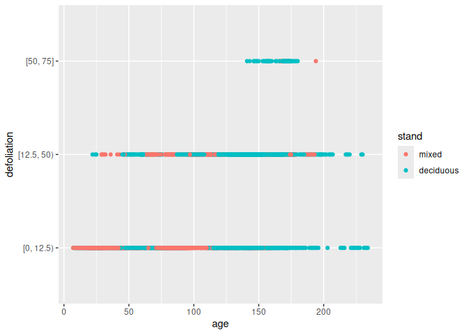

Research Seminar - Logistic Regression
================
Johannes, Kai

- [1 Preamble](#1-preamble)
- [2 Data: `ForestHealth`](#2-data-foresthealth)
- [3 Orinary linear model vs. Logit
  model](#3-orinary-linear-model-vs-logit-model)
- [4 Logit regression](#4-logit-regression)
  - [4.1 Theory](#41-theory)
  - [4.2 Example](#42-example)
- [5 Model diagnostics](#5-model-diagnostics)
  - [5.1 Theory](#51-theory)
  - [5.2 Example](#52-example)
- [6 Model interpretaion](#6-model-interpretaion)
  - [6.1 Example](#61-example)
  - [6.2 Outlook: Multinomial
    regression](#62-outlook-multinomial-regression)
  - [6.3 PhD examples](#63-phd-examples)
- [7 Literature and Material](#7-literature-and-material)
  - [7.1 Primary literature](#71-primary-literature)
  - [7.2 Online resources](#72-online-resources)
  - [7.3 Books](#73-books)

# 1 Preamble

This README file serves as an outline of today’s topics and contains all
required materials or links to the materials. This file and all
materials can be found on github. Today’s aim is

- to explain the structure of the **data** for which a logistic
  regression can be performed,
- to explain the special properties of the **logistic regression** and
  thereby introduce the concept of generalized regression, and
- to **perform and interpret** a logistic regression in `R`.
- At the end, examples from **current research projects** are shown and
  discussed.

The martial contains texts and examples from the textbook Fahrmeir et
al. (2013) as well as parts and ideas from the corresponding lecture
`GLM` by Prof. Thomas Kneib, Chair of Statistics. Furthermore, parts of
the lectures `Statistical Data Analysis with R` and
`Advanced Statistical Programming` of the forest faculty are included.

We are using the following libraries:

``` r
library(tidyverse)  # Data science
library(ggplot2)    # Visualization

# GLM itself is part of the stats package, which is loaded at start up
library(ggeffects)  # Visual interpretation of statistical models
library(emmeans)    # Testing linear hypotheses
```

We kindly ask you to prepare all tasks that are not tagged as ‘in class’
for the research seminar.

**Task 0:** Getting ready

- Connect to the repository and clone it to your laptop
- Install the required libraries

Modelling survival probabilities, also known as survival analysis, is
one of the most important applications for which logistic regression is
used and which we will use as an example today. Another famous field of
application is the questionnaire analysis, which will be sketched in the
PdD examples at the end. The special property of survival data is that
the response variable can only have binary (or more generally
categorical) outcomes. This property is the reason, why the values of
the response that are to be estimated have different outcomes than the
observations of the response variable. In logistic regression, not the
outcome of an observation (e.g. dead or alive) is estmimated, but the
probability that an observation shows an outcome. Logistic regression is
a possibility to fit a survival probability curve over a continuous
variable of interest, e.g. the tree age. Logistic regression is
therefore an alternative to the well-known Weibull survival curves. The
logit curve resulting from the regression has similar properties as the
cumulative Weibull distribution. Also the interpretation is comparable.

# 2 Data: `ForestHealth`

Consider the example data set `forest health` from Fahrmeir et
al. (2013). The data set consists of 16 variables with 1796 observations
on forest health to identify potential factors influencing the health
status of trees and therefore the vital status of the forest. In
addition to covariates characterizing a tree and its stand, the exact
locations of the trees are known. The interest is on detecting temporal
and spatial trends while accounting for further covariate effects in a
flexible manner. The data in our example come from a specific project in
the forest of Rothenbuch (Spessart), which has been carried out by Axel
Göttlein (Technical University, Munich) since 1982. Five tree species
are part of this survey: beech, oak, spruce, larch, and pine. Here we
will restrict ourselves to beech trees. Every year, the condition of
beech trees is categorized by three ordinal categories \[0 % - 12.5),
\[12.5 % - 50 %), and \[50 % - 75 %). The forth category \>75 % is not
captured in the data. The category 0 % signifies that the beech tree is
healthy, the category 100 % implies that the tree is dead. See p. 9 of
Fahrmeir et al. (2013) for more details.

``` r
load("Data/ForestHealth.rda")
ForestHealth %>% ggplot(aes(y = defoliation, x = age, col = stand)) + geom_point()
```

<!-- -->

**Task 1:** Getting familiar with the data and understand the nature of
binary responses

- Load `ForestHealth`
- Calculate a binary response variable that contains healthy
  (defoliation \[0 % - 12.5)) and unhealthy (\[12.5 % - 75 %)) trees
- Perform relevant descriptive statistics
- Which variables might have an impact on the tree health?
- Fit an ordinary linear model `lm` to estimate the health status over
  the age
- Add one another variable that seems to influence the tree health
  - Are these two models suitable to estimate the health status? Give
    some pro and contra arguments and underpin your arguments using
    common numbers or diagrams of (linear) statistical inference.

# 3 Orinary linear model vs. Logit model

Why is the ordinary linear models usually not suited to model binary
responses (and under which conditions could a linear model might be
sufficient)?

**Task 2:** Getting the link between linear models and general linear
models

- Read Lane (2002) and prepare for the following discussion
  - Why do generalized linear model belong to the family of linear model
    even though their curvature is not linear?
  - Which properties distinguish a generalized linear model from a
    *linear* model?
  - Which properties distinguish a generalized linear model from a
    *non-linear* model?

# 4 Logit regression

## 4.1 Theory

## 4.2 Example

# 5 Model diagnostics

## 5.1 Theory

## 5.2 Example

# 6 Model interpretaion

## 6.1 Example

## 6.2 Outlook: Multinomial regression

    - Forest health multinomial
    - Forest health ordered

## 6.3 PhD examples

- Henning
- Valeska

# 7 Literature and Material

This file as well as all other materials are uploaded on GitHub. You
should all have ssh access rights, such that you can use your version
control feature of RStudio to clone the GitHub repository:

<https://github.com/Forest-Economics-Goettingen/Research_Seminar_GLM>
<git@github.com>:Forest-Economics-Goettingen/Research_Seminar_GLM.git

## 7.1 Primary literature

Lane (2002): Generalized linear models in soil science. European Journal
of Soil Science, 53, 241-251.
<https://doi.org/10.1046/j.1365-2389.2002.00440.x>

## 7.2 Online resources

Johannes Signer, Kai Husmann (2024): Kursmaterial: Einführung in die
Datenanalyse mit R.
<https://github.com/Forest-Economics-Goettingen/KursskriptRBsc>

## 7.3 Books

Ludwig Fahrmeir, Thomas Kneib, Stefan Lang, Brian Marx (2013):
Regression : Models, Methods and Applications. Berlin, Heidelberg.
Springer. <https://link.springer.com/book/10.1007/978-3-642-34333-9>
