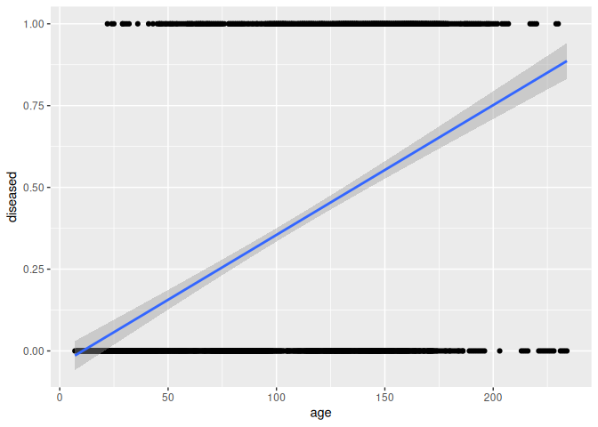

Research Seminar - Logistic Regression
================
Johannes, Kai

- [1 Preamble](#1-preamble)
- [2 Data: `ForestHealth`](#2-data-foresthealth)
- [3 Orinary LM vs. GLM](#3-orinary-lm-vs-glm)
- [4 GLM](#4-glm)
- [5 Logistic regression](#5-logistic-regression)
- [6 Model diagnostics](#6-model-diagnostics)
- [7 Model interpretaion](#7-model-interpretaion)
  - [7.1 Example](#71-example)
  - [7.2 Outlook: Multinomial
    regression](#72-outlook-multinomial-regression)
  - [7.3 PhD examples](#73-phd-examples)
- [8 Literature and Material](#8-literature-and-material)
  - [8.1 Primary literature](#81-primary-literature)
  - [8.2 Online resources](#82-online-resources)
  - [8.3 Books](#83-books)

# 1 Preamble

This README file serves as an outline of today’s topics and contains all
required materials or links to the materials. This file and all
materials can be found on github. Today’s aim is

- to explain the structure of the **data** for which a logistic
  regression can be performed,
- to explain the special properties of the **logistic regression** and
  thereby introduce the concept of generalized regression, and
- to **perform and interpret** a logistic regression in `R`.
- At the end, examples from **current research projects** are shown and
  discussed.

The martial contains texts and examples from the textbook Fahrmeir et
al. (2013) as well as parts and ideas from the corresponding lecture
`GLM` by Prof. Thomas Kneib, Chair of Statistics. Furthermore, parts of
the lectures `Statistical Data Analysis with R` and
`Advanced Statistical Programming` of the forest faculty are included.

We are using the following libraries:

``` r
library(tidyverse)  # Data science
library(ggplot2)    # Visualization

# GLM itself is part of the stats package, which is loaded at start up
library(ggeffects)  # Visual interpretation of statistical models
library(emmeans)    # Testing linear hypotheses
```

We ask you to prepare some tasks beforehand to save some time in the
seminar. Those are tagged as ‘Beforehand task’.

**Beforehand task 0:** Getting ready

- Connect to the repository and clone it to your laptop
- Get R and R Studio running
- Install the required libraries

Modelling survival probabilities, also known as survival analysis, is
one of the most important and most suitable applications for which
logistic regression is used and which we will also use as an example
today. Another famous field of application is the questionnaire
analysis, which will be sketched in the PdD examples at the end. The
special property of survival data is that the response variable can only
have binary (or more generally categorical) outcomes. Individuals will
survive until one specific time point. Idea of survival modelling is to
estimate this time point and possibly additionally inference the reasons
survival (or non-survival respectively). This 0/1 property is the
reason, why the values of the response that are to be estimated have
different outcomes than the observations of the response variable. In
logistic regression, not the outcome of an observation (e.g. dead or
alive) is estimated, but the probability that an observation shows an
outcome (e.g. suvival). Logistic regression is a possibility to fit a
survival probability curve over a continuous variable of interest,
e.g. the tree age. Logistic regression is thus an alternative to the
well-known Weibull survival curves. The logit curve resulting from the
regression has similar properties as the cumulative Weibull
distribution. Also the interpretation is comparable.

# 2 Data: `ForestHealth`

Consider the example data set `forest health` from Fahrmeir et
al. (2013). The data set consists of 16 variables with 1796 observations
on forest health to identify potential factors influencing the health
status of trees and therefore the vital status of the forest. In
addition to covariates characterizing a tree and its stand, the exact
locations of the trees are known. The interest is on detecting temporal
and spatial trends while accounting for further covariate effects in a
flexible manner. The data in our example come from a specific project in
the forest of Rothenbuch (Spessart), which has been carried out by Axel
Göttlein (Technical University, Munich) since 1982. Five tree species
are part of this survey: beech, oak, spruce, larch, and pine. Here we
will restrict ourselves to beech trees. Every year, the condition of
beech trees is categorized by three ordinal categories \[0 % - 12.5),
\[12.5 % - 50 %), and \[50 % - 75 %). The forth category \>75 % is not
captured in the data. The category 0 % signifies that the beech tree is
healthy, the category 100 % implies that the tree is dead. See p. 9 of
Fahrmeir et al. (2013) for more details.

``` r
load("Data/ForestHealth.rda")
ForestHealth %>% ggplot(aes(y = defoliation, x = age, col = stand)) + geom_point()
```

<!-- -->

**Beforehand Task 1:** Getting familiar with the data and understand the
nature of binary responses

- Load `ForestHealth`
- Calculate a binary response variable that contains healthy
  (defoliation \[0 % - 12.5)) and unhealthy (\[12.5 % - 75 %)) trees
- Perform relevant descriptive statistics
- Which variables might have an impact on the tree health?
- Fit an ordinary linear model `lm` to estimate the health status over
  the age
- Add one another variable that seems to influence the tree health
  - Are these two models suitable to estimate the health status? Give
    some pro and contra arguments and underpin your arguments using
    common numbers or diagrams of (linear) statistical inference.

``` r
ForestHealth <- ForestHealth %>% mutate(diseased = ifelse(defoliation %in% "[0, 12.5)", 0, 1))
ForestHealth %>% ggplot(aes(y = diseased, x = age)) + geom_point() +
  geom_smooth(method = "lm")
```

    ## `geom_smooth()` using formula = 'y ~ x'

<!-- -->

# 3 Orinary LM vs. GLM

Motivating example for GLMs: Why is the ordinary linear models usually
not suited to model binary responses (and under which conditions could a
linear model might be sufficient)?

**Beforehand Task 2:** What is the differnce between linear models and
general linear models? What is the G in GLM?

- Read Lane (2002) and prepare for the following discussion
  - Why do generalized linear model belong to the family of linear model
    even though their curvature is not linear?
  - Which properties distinguish a *generalized linear model* from a
    *linear* model? In particular: What is a link function?
  - Which properties distinguish a *generalized linear model* from a
    *non-linear* model?

# 4 GLM

@Johannes, ich habe schon Mal was zu GLM vorbereitet, siehe misc. Das
ist aber zu viel. Mich würde deine Meinung interessieren, ob es sich
lohnt davon wsa zu recyclen?

# 5 Logistic regression

Instead of modelling $y_i$ directly, we define a regression model that
estimates the possibility of a discrete status 1 (e.g. dead)

$$
\pi_i=\text{E}(y_i)=P(y_i=1),
$$ where $\pi_i$ shall vary continuously between 0 and 1 even tough
$y_i$ is discrete. To achieve $\pi_i \in[0, 1]$, we apply a
transformation (in the sense of Lane (2002)) that transforms (“links”)
the linear regression formula to the deserved properties. The linear
regression formula (so to speak the linear core of the GLM)

$$
\eta_i=\beta_0+\beta_1 x_{i1}+ \dots + \beta_k x_{ik}
$$ is called linear predictor. Instead of using a quite simple link
function as Lane (2002) did (the logaritm), binomial regression requires
a more sophisticated transformation

$$
\pi_i=h(\eta_i).
$$

Along with some less familiar transformations, the logit transformation
leads to the desired properties, which is why the binomial is sometimes
referred to as logit regression. The term logistic regression comes from
the logistic curvature that follows from the logit transformation. The
logit response function $h$ relies on the logistic cumulative
distribution function

$$
\pi=h(\eta)=\frac{\text{exp}(\eta)}{1+\text{exp}(\eta)}.
$$ The respective inverse, also called link function $h$ reads as $$
g(\pi)=\text{log} \left( \frac{\pi}{1 - \pi}\ \right).
$$ The response function follows a Bernoulli distribution. However,
grouping observation with same outcomes makes the solving process more
efficient and then leads to a Binomial distribution (Fahrmeir et al.,
2023, p. 270 - 277), which is why in practiced programming, the Binomial
or Quasibinomial distributions are usually taken.

@Johannes, würdest du Logits per Hand rechnen lassen und dann in lm? Um
in der Logik von dem Lane Paper zu beleiben?

**Task 3:** Modeling a disease probability model

- Calculate Logits by hand
- Create a univariate GLM over tree age
- Create a multiple GLM over age and self-chosen promising covariates,
  save separate to the simple GLM

``` r
# Solution
```

# 6 Model diagnostics

Von uns vorgestelltes Summary gemeinsam erklären Kreuzvalidierung?

# 7 Model interpretaion

Von uns vorgestelltes Summary gemeinsam erklären Odds multiplicative -\>
hard to interprete

## 7.1 Example

## 7.2 Outlook: Multinomial regression

Text und Code verfassen und nur vorstellen, keine Übungsaufgabe

    - Forest health multinomial
    - Forest health ordered

## 7.3 PhD examples

- Henning
- Valeska

# 8 Literature and Material

This file as well as all other materials are uploaded on GitHub. You
should all have ssh access rights, such that you can use your version
control feature of RStudio to clone the GitHub repository:

<https://github.com/Forest-Economics-Goettingen/Research_Seminar_GLM>
<git@github.com>:Forest-Economics-Goettingen/Research_Seminar_GLM.git

## 8.1 Primary literature

Lane (2002): Generalized linear models in soil science. European Journal
of Soil Science, 53, 241-251.
<https://doi.org/10.1046/j.1365-2389.2002.00440.x>

## 8.2 Online resources

Johannes Signer, Kai Husmann (2024): Kursmaterial: Einführung in die
Datenanalyse mit R.
<https://github.com/Forest-Economics-Goettingen/KursskriptRBsc>

## 8.3 Books

Ludwig Fahrmeir, Thomas Kneib, Stefan Lang, Brian Marx (2013):
Regression : Models, Methods and Applications. Berlin, Heidelberg.
Springer. <https://link.springer.com/book/10.1007/978-3-642-34333-9>
