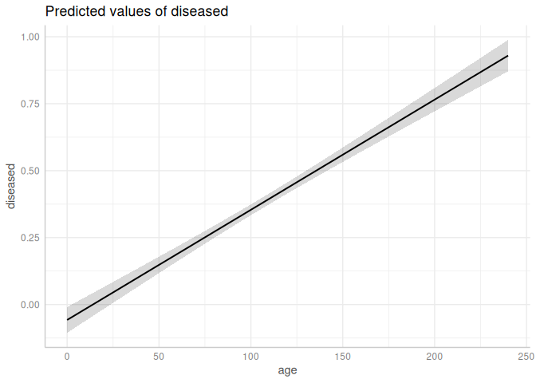
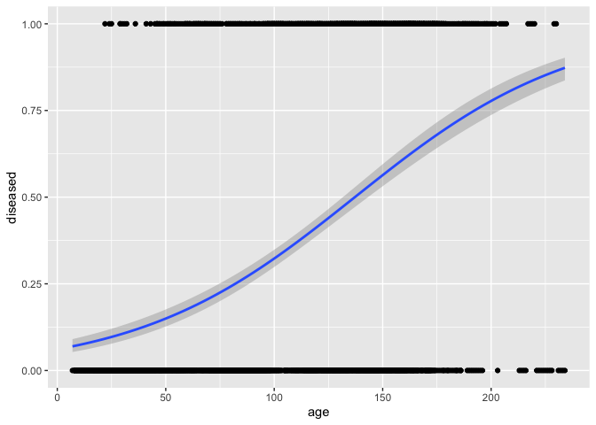
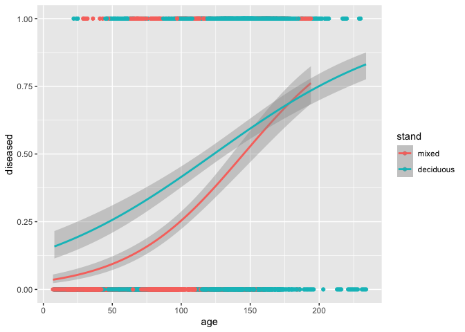
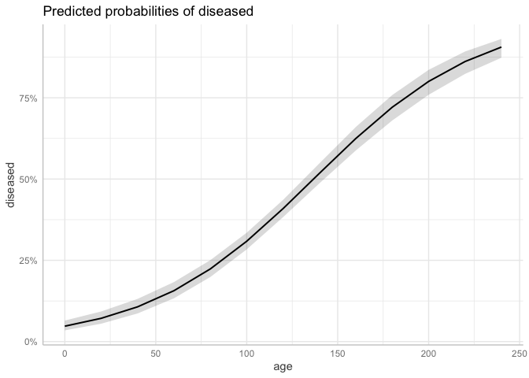
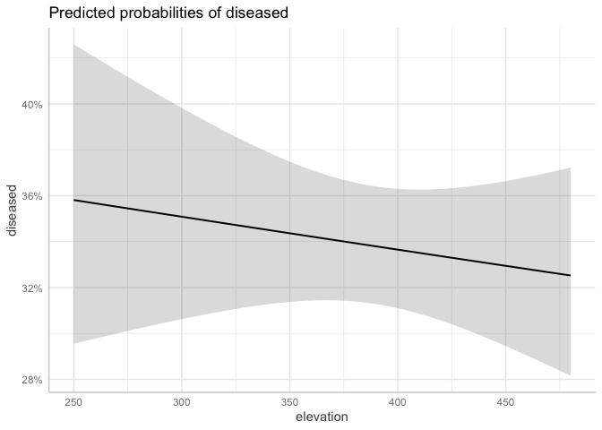
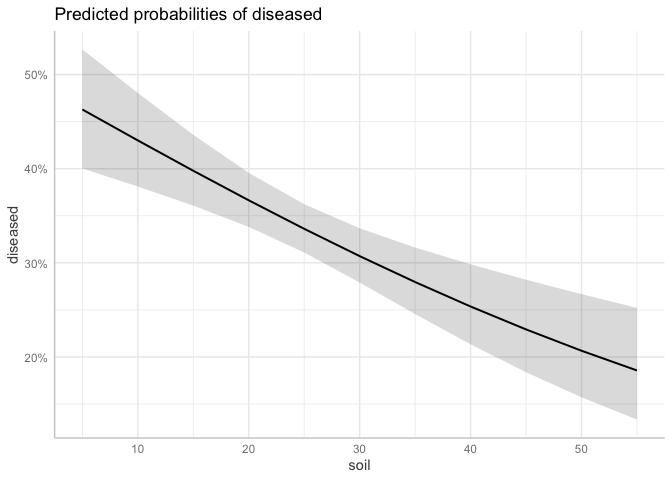

Research Seminar - Logistic Regression
================
Kai & Johannes

- [1 Preamble](#1-preamble)
- [2 Data: `ForestHealth`](#2-data-foresthealth)
- [3 Orinary LM vs. GLM](#3-orinary-lm-vs-glm)
- [4 GLM](#4-glm)
  - [4.1 Logistic regression](#41-logistic-regression)
  - [4.2 Model diagnostics](#42-model-diagnostics)
  - [4.3 Model interpretaion](#43-model-interpretaion)
- [5 Outlook: Multinomial regression](#5-outlook-multinomial-regression)
  - [5.1 Unordered catagories](#51-unordered-catagories)
  - [5.2 Ordered categories](#52-ordered-categories)
  - [5.3 PhD examples](#53-phd-examples)
- [6 Literature and Material](#6-literature-and-material)
  - [6.1 Primary literature](#61-primary-literature)
  - [6.2 Online resources](#62-online-resources)
  - [6.3 Books](#63-books)

# 1 Preamble

This README file serves as an outline of today’s topics and contains all
required materials or links to the materials. This file and all
materials can be found on github. Today’s aim is

- to explain the structure of the **data** for which a logistic
  regression can be performed,
- to explain the special properties of the **logistic regression** and
  thereby introduce the concept of generalized regression, and
- to **perform and interpret** a logistic regression in `R`.
- At the end, examples from **current research projects** are shown and
  discussed.

The martial contains texts and examples from the textbook Fahrmeir et
al. (2013) as well as parts and ideas from the corresponding lecture
`GLM` by Prof. Thomas Kneib, Chair of Statistics. Furthermore, parts of
the lectures `Statistical Data Analysis with R` and
`Advanced Statistical Programming` of the forest faculty are included.

We are using the following libraries:

``` r
library(tidyverse)  # Data science
library(ggplot2)    # Visualization
library(boot)       # For logit() and inv.logit()

# GLM itself is part of the stats package, which is loaded at start up
library(ggeffects)  # Visual interpretation of statistical models
library(emmeans)    # Testing linear hypotheses
```

We ask you to prepare some tasks beforehand to save some time in the
seminar. Those are tagged as ‘Beforehand task’.

**Beforehand task 0:** Getting ready

- Connect to the repository and clone it to your laptop
- Get R and R Studio running
- Install the required libraries

Modelling survival probabilities, also known as survival analysis, is
one of the most important and most suitable applications for which
logistic regression is used and which we will also use as an example
today. Another widely used field of application is the analysis of
questionnaires, which will be sketched in the PhD examples at the end.
The special property of survival data is that the response variable can
only have binary (or more generally categorical) outcomes. Individuals
will survive until one specific time point. The idea of survival
modelling is to estimate this time point and possibly additionally
inference the reasons survival (or non-survival respectively). This 0/1
property is the reason, why the values of the response that are to be
estimated have different outcomes than the observations of the response
variable. In logistic regression, not the outcome of an observation
(e.g. dead or alive) is estimated, but the **probability that an
observation shows an outcome** (e.g. survival). Logistic regression is a
possibility to fit a survival probability curve over a continuous
variable of interest, e.g. the tree age. Logistic regression is thus an
alternative to the well-known Weibull survival curves. The logit curve
resulting from the regression has similar properties as the cumulative
Weibull distribution. Also the interpretation is comparable.

# 2 Data: `ForestHealth`

Consider the example data set `forest health` from Fahrmeir et
al. (2013). The data set consists of 16 variables with 1796 observations
on forest health to identify potential factors influencing the health
status of trees and therefore the vital status of the forest. In
addition to covariates characterizing a tree and its stand, the exact
locations of the trees are known. The interest is on detecting temporal
and spatial trends while accounting for further covariate effects in a
flexible manner. The data in our example come from a specific project in
the forest of Rothenbuch (Spessart), which has been carried out by Axel
Göttlein (Technical University, Munich) since 1982. Five tree species
are part of this survey: beech, oak, spruce, larch, and pine. Here we
will restrict ourselves to beech trees. Every year, the condition of
beech trees is categorized by three ordinal categories \[0 % - 12.5),
\[12.5 % - 50 %), and \[50 % - 75 %). The forth category \>75 % is not
captured in the data. The category 0 % signifies that the beech tree is
healthy, the category 100 % implies that the tree is dead. See p. 9 of
Fahrmeir et al. (2013) for more details.

``` r
load("Data/ForestHealth.rda") # rds?
ForestHealth %>% ggplot(aes(y = defoliation, x = age, col = stand)) + geom_point()
```

<!-- -->

**Beforehand Task 1:** Getting familiar with the data and understand the
nature of binary responses

- Load `ForestHealth`
- Calculate a binary response variable that contains healthy
  (defoliation \[0 % - 12.5)) and unhealthy (\[12.5 % - 75 %)) trees
- Perform relevant descriptive statistics
- Which variables might have an impact on the tree health?
- Fit an ordinary linear model `lm` to estimate the health status over
  the age
- Add one another variable that seems to influence the tree health
  - Are these two models suitable to estimate the health status? Give
    some pro and contra arguments and underpin your arguments using
    common numbers or diagrams of (linear) statistical inference.

``` r
ForestHealth <- ForestHealth %>% mutate(diseased = ifelse(defoliation %in% "[0, 12.5)", 0, 1))
ForestHealth %>% ggplot(aes(y = diseased, x = age)) + geom_point() +
  geom_smooth(method = "lm")
```

    ## `geom_smooth()` using formula = 'y ~ x'

<!-- -->

``` r
lm_simple <- ForestHealth %>% lm(diseased ~ age, data = .)
summary(lm_simple)
```

    ## 
    ## Call:
    ## lm(formula = diseased ~ age, data = .)
    ## 
    ## Residuals:
    ##     Min      1Q  Median      3Q     Max 
    ## -0.8864 -0.3389 -0.1009  0.4270  0.9547 
    ## 
    ## Coefficients:
    ##               Estimate Std. Error t value Pr(>|t|)    
    ## (Intercept) -0.0419314  0.0238913  -1.755   0.0794 .  
    ## age          0.0039671  0.0002026  19.584   <2e-16 ***
    ## ---
    ## Signif. codes:  0 '***' 0.001 '**' 0.01 '*' 0.05 '.' 0.1 ' ' 1
    ## 
    ## Residual standard error: 0.4406 on 1791 degrees of freedom
    ## Multiple R-squared:  0.1764, Adjusted R-squared:  0.1759 
    ## F-statistic: 383.5 on 1 and 1791 DF,  p-value: < 2.2e-16

``` r
lm_multiple <- ForestHealth %>% select(age, elevation, soil, ph, fertilized, diseased) %>%  lm(diseased ~ ., data = .)
summary(lm_multiple)
```

    ## 
    ## Call:
    ## lm(formula = diseased ~ ., data = .)
    ## 
    ## Residuals:
    ##     Min      1Q  Median      3Q     Max 
    ## -0.7686 -0.3696 -0.1069  0.3722  0.9440 
    ## 
    ## Coefficients:
    ##                Estimate Std. Error t value Pr(>|t|)    
    ## (Intercept)   0.3013240  0.1641404   1.836   0.0666 .  
    ## age           0.0041132  0.0002102  19.564  < 2e-16 ***
    ## elevation    -0.0001429  0.0001750  -0.817   0.4140    
    ## soil         -0.0049648  0.0010715  -4.633 3.86e-06 ***
    ## ph           -0.0588980  0.0313381  -1.879   0.0603 .  
    ## fertilizedno  0.1162940  0.0136518   8.519  < 2e-16 ***
    ## ---
    ## Signif. codes:  0 '***' 0.001 '**' 0.01 '*' 0.05 '.' 0.1 ' ' 1
    ## 
    ## Residual standard error: 0.4293 on 1787 degrees of freedom
    ## Multiple R-squared:  0.2198, Adjusted R-squared:  0.2176 
    ## F-statistic: 100.7 on 5 and 1787 DF,  p-value: < 2.2e-16

``` r
ggeffects::ggeffect(lm_multiple, terms = "age") %>% plot()
```

<!-- -->

# 3 Orinary LM vs. GLM

Motivating example for GLMs: Why is the ordinary linear models usually
not suited to model binary responses (and under which conditions could a
linear model might be sufficient)?

**Beforehand Task 2:** What is the differnce between linear models and
general linear models? What is the G in GLM?

- Read Lane (2002) and prepare for the following discussion
  - Why do generalized linear model belong to the family of linear model
    even though their curvature is not linear?
  - Which properties distinguish a *generalized linear model* from a
    *linear* model? In particular: What is a link function?
  - Which properties distinguish a *generalized linear model* from a
    *non-linear* model?

# 4 GLM

## 4.1 Logistic regression

Instead of modelling $y_i$ directly, we define a regression model that
estimates the possibility of a discrete status 1 (e.g. dead)

$$
\pi_i=\text{E}(y_i)=P(y_i=1),
$$

where $\pi_i$ shall vary continuously between 0 and 1 even tough $y_i$
is discrete. To achieve $\pi_i \in[0, 1]$, we apply a transformation (in
the sense of Lane (2002)) that transforms (“links”) the linear
regression formula to the deserved properties. The linear regression
formula (so to speak the linear core of the GLM)

$$
\eta_i=\beta_0+\beta_1 x_{i1}+ \dots + \beta_k x_{ik}
$$

is called linear predictor. Instead of using a quite simple link
function as Lane (2002) did (the logaritm), binomial regression requires
a more sophisticated transformation

$$
\pi_i=h(\eta_i).
$$

Along with some less familiar transformations, the logit transformation
leads to the desired properties, which is why the binomial is sometimes
referred to as logit regression. The term logistic regression comes from
the logistic curvature that follows from the logit transformation. The
logit response function $h$ relies on the logistic cumulative
distribution function

$$
\pi=h(\eta)=\frac{\text{exp}(\eta)}{1+\text{exp}(\eta)}.
$$

The respective inverse, also called link function $h$ reads as

$$
g(\pi)=\text{log} \left( \frac{\pi}{1 - \pi}\ \right).
$$

The response function follows a Bernoulli distribution. However,
grouping observation with same outcomes makes the solving process more
efficient and then leads to a Binomial distribution (Fahrmeir et al.,
2023, p. 270 - 277), which is why in practiced programming, the Binomial
or Quasibinomial distributions are usually taken. You should stick to
these standard combination of distributions of link functions, however,
you can freely decide for any of the distributions of the so called
exponential family if want.

``` r
# Rename
fh <- ForestHealth
head(fh)
```

    ##   id year defoliation   x y age canopy inclination elevation soil   ph
    ## 1  5 1983   [0, 12.5) 1.5 5  43      1           2       320   10 4.61
    ## 2  5 1984   [0, 12.5) 1.5 5  44      1           2       320   10 4.34
    ## 3  5 1985   [0, 12.5) 1.5 5  45      1           2       320   10 4.75
    ## 4  5 1986   [0, 12.5) 1.5 5  46      1           2       320   10 3.99
    ## 5  5 1987   [0, 12.5) 1.5 5  47      1           2       320   10 5.30
    ## 6  5 1988   [0, 12.5) 1.5 5  48      1           2       320   10 3.83
    ##         moisture alkali      humus stand fertilized diseased
    ## 1 moderately dry   high (1cm, 2cm] mixed        yes        0
    ## 2 moderately dry   high (3cm, 4cm] mixed        yes        0
    ## 3 moderately dry   high [0cm, 1cm] mixed        yes        0
    ## 4 moderately dry   high (2cm, 3cm] mixed        yes        0
    ## 5 moderately dry   high [0cm, 1cm] mixed        yes        0
    ## 6 moderately dry   high [0cm, 1cm] mixed        yes        0

``` r
fh <- fh %>% mutate(diseased = as.numeric(defoliation != "[0, 12.5)"))
head(fh)
```

    ##   id year defoliation   x y age canopy inclination elevation soil   ph
    ## 1  5 1983   [0, 12.5) 1.5 5  43      1           2       320   10 4.61
    ## 2  5 1984   [0, 12.5) 1.5 5  44      1           2       320   10 4.34
    ## 3  5 1985   [0, 12.5) 1.5 5  45      1           2       320   10 4.75
    ## 4  5 1986   [0, 12.5) 1.5 5  46      1           2       320   10 3.99
    ## 5  5 1987   [0, 12.5) 1.5 5  47      1           2       320   10 5.30
    ## 6  5 1988   [0, 12.5) 1.5 5  48      1           2       320   10 3.83
    ##         moisture alkali      humus stand fertilized diseased
    ## 1 moderately dry   high (1cm, 2cm] mixed        yes        0
    ## 2 moderately dry   high (3cm, 4cm] mixed        yes        0
    ## 3 moderately dry   high [0cm, 1cm] mixed        yes        0
    ## 4 moderately dry   high (2cm, 3cm] mixed        yes        0
    ## 5 moderately dry   high [0cm, 1cm] mixed        yes        0
    ## 6 moderately dry   high [0cm, 1cm] mixed        yes        0

``` r
# Intercept only model

mean(fh$diseased)
```

    ## [1] 0.3792526

``` r
# A linear model
m1 <- lm(diseased ~ 1, data = fh)
coef(m1)
```

    ## (Intercept) 
    ##   0.3792526

``` r
# GLM
m2 <- glm(diseased ~ 1, family = binomial(), data = fh)

predict(m2, type = "response")[1]
```

    ##         1 
    ## 0.3792526

``` r
predict(m2, type = "link")[1]
```

    ##          1 
    ## -0.4927216

``` r
inv.logit(coef(m2))[1]
```

    ## (Intercept) 
    ##   0.3792526

``` r
# We could calculate it without a model

p <- mean(fh$diseased)

p
```

    ## [1] 0.3792526

``` r
logit(p)
```

    ## [1] -0.4927216

``` r
inv.logit(logit(p))
```

    ## [1] 0.3792526

``` r
# With Groups
# Lets calcualte the probability for being diseased for different stand
# types

m1 <- glm(diseased ~ stand, family = binomial(), data = fh)
summary(m1)
```

    ## 
    ## Call:
    ## glm(formula = diseased ~ stand, family = binomial(), data = fh)
    ## 
    ## Coefficients:
    ##             Estimate Std. Error z value Pr(>|z|)    
    ## (Intercept) -0.53077    0.05077  -10.45   <2e-16 ***
    ## standmixed  -0.53077    0.05077  -10.45   <2e-16 ***
    ## ---
    ## Signif. codes:  0 '***' 0.001 '**' 0.01 '*' 0.05 '.' 0.1 ' ' 1
    ## 
    ## (Dispersion parameter for binomial family taken to be 1)
    ## 
    ##     Null deviance: 2380  on 1792  degrees of freedom
    ## Residual deviance: 2266  on 1791  degrees of freedom
    ## AIC: 2270
    ## 
    ## Number of Fisher Scoring iterations: 4

``` r
unique(fh$stand)
```

    ## [1] mixed     deciduous
    ## Levels: mixed deciduous

``` r
nd <- data.frame(stand = c("deciduous", "mixed"))
predict(m1, nd, type = "response")
```

    ##         1         2 
    ## 0.5000000 0.2570146

``` r
predict(m1, nd, type = "link")
```

    ##             1             2 
    ##  1.620926e-14 -1.061544e+00

``` r
inv.logit(predict(m1, nd, type = "link"))
```

    ##         1         2 
    ## 0.5000000 0.2570146

``` r
# A linear model does no longer work
m2 <- lm(diseased ~ stand, data = fh)
coef(m2)
```

    ## (Intercept)  standmixed 
    ##   0.3785073  -0.1214927

``` r
# However, we could do the logit transformation beforehand
d1 <- data.frame(
  stand = c("mixed", "deciduous"), 
  logit = table(fh$stand, fh$diseased) |> 
    apply(1, function(x) x[2] / sum(x)) |> 
    logit()
)
d1
```

    ##               stand     logit
    ## mixed         mixed -1.061544
    ## deciduous deciduous  0.000000

``` r
# And then estimate a linear model and then backtransform
m3 <- lm(logit ~ stand, data = d1)
coef(m3)
```

    ##   (Intercept)    standmixed 
    ##  3.400754e-17 -1.061544e+00

``` r
inv.logit(coef(m3))
```

    ## (Intercept)  standmixed 
    ##   0.5000000   0.2570146

``` r
# Now lets add a continouse covariate -- age. We have to bin age and transform each bin and fit a linear model to this data. 
range(fh$age)
```

    ## [1]   7 234

``` r
cut(fh$age, breaks = seq(20, 240, 20))
```

    ##    [1] (40,60]   (40,60]   (40,60]   (40,60]   (40,60]   (40,60]   (40,60]  
    ##    [8] (40,60]   (40,60]   (40,60]   (40,60]   (40,60]   (40,60]   (40,60]  
    ##   [15] (40,60]   (40,60]   (40,60]   (40,60]   (60,80]   (60,80]   (60,80]  
    ##   [22] (60,80]   (100,120] (100,120] (100,120] (100,120] (100,120] (120,140]
    ##   [29] (120,140] (120,140] (120,140] (120,140] (120,140] (120,140] (120,140]
    ##   [36] (120,140] (120,140] (120,140] (120,140] (120,140] (120,140] (120,140]
    ##   [43] (120,140] (120,140] <NA>      <NA>      <NA>      <NA>      (20,40]  
    ##   [50] (20,40]   (20,40]   (20,40]   (20,40]   (20,40]   (20,40]   (20,40]  
    ##   [57] (20,40]   (20,40]   (20,40]   (20,40]   (20,40]   (20,40]   (20,40]  
    ##   [64] (20,40]   (20,40]   (20,40]   (60,80]   (60,80]   (60,80]   (60,80]  
    ##   [71] (60,80]   (60,80]   (80,100]  (80,100]  (80,100]  (80,100]  (80,100] 
    ##   [78] (80,100]  (80,100]  (80,100]  (80,100]  (80,100]  (80,100]  (80,100] 
    ##   [85] (80,100]  (80,100]  (80,100]  (80,100]  (40,60]   (40,60]   (40,60]  
    ##   [92] (40,60]   (40,60]   (40,60]   (40,60]   (40,60]   (40,60]   (40,60]  
    ##   [99] (40,60]   (40,60]   (40,60]   (40,60]   (60,80]   (60,80]   (60,80]  
    ##  [106] (60,80]   (60,80]   (60,80]   (60,80]   (60,80]   (20,40]   (20,40]  
    ##  [113] (20,40]   (20,40]   (20,40]   (20,40]   (20,40]   (40,60]   (40,60]  
    ##  [120] (40,60]   (40,60]   (40,60]   (40,60]   (40,60]   (40,60]   (40,60]  
    ##  [127] (40,60]   (40,60]   (40,60]   (40,60]   (40,60]   (40,60]   (140,160]
    ##  [134] (140,160] (140,160] (140,160] (140,160] (140,160] (140,160] (140,160]
    ##  [141] (140,160] (140,160] (140,160] (140,160] (140,160] (140,160] (140,160]
    ##  [148] (140,160] (140,160] (140,160] (160,180] (160,180] (160,180] (160,180]
    ##  [155] (100,120] (100,120] (100,120] (100,120] (100,120] (100,120] (100,120]
    ##  [162] (100,120] (120,140] (120,140] (120,140] (120,140] (120,140] (120,140]
    ##  [169] (120,140] (120,140] (120,140] (120,140] (120,140] (120,140] (120,140]
    ##  [176] (120,140] (80,100]  (80,100]  (80,100]  (80,100]  (80,100]  (80,100] 
    ##  [183] (80,100]  (80,100]  (80,100]  (80,100]  (80,100]  (80,100]  (80,100] 
    ##  [190] (80,100]  (80,100]  (80,100]  (80,100]  (80,100]  (80,100]  (100,120]
    ##  [197] (100,120] (100,120] (140,160] (140,160] (140,160] (140,160] (160,180]
    ##  [204] (160,180] (160,180] (160,180] (160,180] (160,180] (160,180] (160,180]
    ##  [211] (160,180] (160,180] (160,180] (160,180] (160,180] (160,180] (160,180]
    ##  [218] (160,180] (160,180] (160,180] (140,160] (140,160] (140,160] (140,160]
    ##  [225] (160,180] (160,180] (160,180] (160,180] (160,180] (160,180] (160,180]
    ##  [232] (160,180] (160,180] (160,180] (160,180] (160,180] (160,180] (160,180]
    ##  [239] (160,180] (160,180] (160,180] (160,180] (120,140] (120,140] (120,140]
    ##  [246] (120,140] (120,140] (120,140] (120,140] (120,140] (120,140] (140,160]
    ##  [253] (140,160] (140,160] (140,160] (140,160] (140,160] (140,160] (140,160]
    ##  [260] (140,160] (140,160] (140,160] (140,160] (140,160] (40,60]   (40,60]  
    ##  [267] (40,60]   (40,60]   (40,60]   (40,60]   (40,60]   (40,60]   (40,60]  
    ##  [274] (40,60]   (40,60]   (40,60]   (40,60]   (40,60]   (40,60]   (40,60]  
    ##  [281] (40,60]   (40,60]   (40,60]   (60,80]   (60,80]   (60,80]   (20,40]  
    ##  [288] (20,40]   (20,40]   (40,60]   (40,60]   (40,60]   (40,60]   (40,60]  
    ##  [295] (40,60]   (40,60]   (40,60]   (40,60]   (40,60]   (40,60]   (40,60]  
    ##  [302] (40,60]   (40,60]   (40,60]   (40,60]   (40,60]   (40,60]   (40,60]  
    ##  [309] (120,140] (120,140] (120,140] (120,140] (120,140] (120,140] (120,140]
    ##  [316] (120,140] (120,140] (120,140] (140,160] (140,160] (140,160] (140,160]
    ##  [323] (140,160] (140,160] (140,160] (140,160] (140,160] (140,160] (140,160]
    ##  [330] (140,160] (80,100]  (80,100]  (80,100]  (80,100]  (80,100]  (80,100] 
    ##  [337] (80,100]  (80,100]  (80,100]  (80,100]  (80,100]  (80,100]  (80,100] 
    ##  [344] (80,100]  (80,100]  (80,100]  (80,100]  (80,100]  (80,100]  (100,120]
    ##  [351] (100,120] (100,120] (120,140] (120,140] (120,140] (120,140] (120,140]
    ##  [358] (120,140] (120,140] (120,140] (120,140] (120,140] (120,140] (120,140]
    ##  [365] (120,140] (120,140] (140,160] (140,160] (140,160] (140,160] (140,160]
    ##  [372] (140,160] (140,160] (140,160] (120,140] (120,140] (120,140] (120,140]
    ##  [379] (120,140] (120,140] (120,140] (120,140] (120,140] (120,140] (120,140]
    ##  [386] (120,140] (120,140] (120,140] (140,160] (140,160] (140,160] (140,160]
    ##  [393] (140,160] (140,160] (140,160] (140,160] (80,100]  (80,100]  (80,100] 
    ##  [400] (80,100]  (80,100]  (80,100]  (80,100]  (80,100]  (80,100]  (80,100] 
    ##  [407] (80,100]  (80,100]  (80,100]  (80,100]  (80,100]  (80,100]  (80,100] 
    ##  [414] (100,120] (100,120] (100,120] (100,120] (100,120] (140,160] (140,160]
    ##  [421] (140,160] (140,160] (140,160] (140,160] (140,160] (140,160] (140,160]
    ##  [428] (140,160] (140,160] (140,160] (140,160] (140,160] (140,160] (140,160]
    ##  [435] (140,160] (140,160] (160,180] (160,180] (160,180] (160,180] (40,60]  
    ##  [442] (40,60]   (60,80]   (60,80]   (60,80]   (60,80]   (60,80]   (60,80]  
    ##  [449] (60,80]   (60,80]   (60,80]   (60,80]   (60,80]   (60,80]   (60,80]  
    ##  [456] (60,80]   (60,80]   (60,80]   (60,80]   (60,80]   (60,80]   (60,80]  
    ##  [463] (20,40]   (20,40]   (40,60]   (40,60]   (40,60]   (40,60]   (40,60]  
    ##  [470] (40,60]   (40,60]   (40,60]   (40,60]   (40,60]   (40,60]   (40,60]  
    ##  [477] (40,60]   (40,60]   (40,60]   (40,60]   (40,60]   (40,60]   (40,60]  
    ##  [484] (40,60]   <NA>      <NA>      (20,40]   (20,40]   (20,40]   (20,40]  
    ##  [491] (20,40]   (20,40]   (20,40]   (20,40]   (20,40]   (20,40]   (20,40]  
    ##  [498] (120,140] (120,140] (120,140] (120,140] (120,140] (140,160] (140,160]
    ##  [505] (140,160] (140,160] (140,160] (140,160] (140,160] (140,160] (140,160]
    ##  [512] (140,160] (140,160] (140,160] (140,160] (140,160] (140,160] (140,160]
    ##  [519] (140,160] (20,40]   (20,40]   (20,40]   (20,40]   (20,40]   (20,40]  
    ##  [526] (20,40]   (20,40]   (20,40]   (20,40]   (20,40]   (20,40]   (20,40]  
    ##  [533] (20,40]   (40,60]   (40,60]   (40,60]   (40,60]   (40,60]   (40,60]  
    ##  [540] (40,60]   (40,60]   (120,140] (120,140] (140,160] (140,160] (140,160]
    ##  [547] (140,160] (140,160] (140,160] (140,160] (140,160] (140,160] (140,160]
    ##  [554] (140,160] (140,160] (140,160] (140,160] (140,160] (140,160] (140,160]
    ##  [561] (140,160] (140,160] (140,160] (180,200] (180,200] (180,200] (180,200]
    ##  [568] (180,200] (180,200] (180,200] (180,200] (180,200] (180,200] (180,200]
    ##  [575] (180,200] (180,200] (180,200] (180,200] (200,220] (200,220] (200,220]
    ##  [582] (200,220] (200,220] (200,220] (200,220] (60,80]   (60,80]   (60,80]  
    ##  [589] (60,80]   (60,80]   (60,80]   (60,80]   (60,80]   (60,80]   (60,80]  
    ##  [596] (80,100]  (80,100]  (80,100]  (80,100]  (80,100]  (80,100]  (80,100] 
    ##  [603] (80,100]  (80,100]  (80,100]  (80,100]  (80,100]  (60,80]   (60,80]  
    ##  [610] (60,80]   (60,80]   (60,80]   (60,80]   (60,80]   (60,80]   (60,80]  
    ##  [617] (60,80]   (60,80]   (60,80]   (60,80]   (60,80]   (60,80]   (60,80]  
    ##  [624] (60,80]   (80,100]  (80,100]  (80,100]  (80,100]  (80,100]  (120,140]
    ##  [631] (120,140] (120,140] (120,140] (140,160] (140,160] (140,160] (140,160]
    ##  [638] (140,160] (140,160] (140,160] (140,160] (140,160] (140,160] (140,160]
    ##  [645] (140,160] (140,160] (140,160] (140,160] (140,160] (140,160] (140,160]
    ##  [652] (60,80]   (60,80]   (60,80]   (60,80]   (60,80]   (60,80]   (60,80]  
    ##  [659] (60,80]   (60,80]   (60,80]   (60,80]   (80,100]  (80,100]  (80,100] 
    ##  [666] (80,100]  (80,100]  (80,100]  (80,100]  (80,100]  (80,100]  (80,100] 
    ##  [673] (80,100]  (20,40]   (20,40]   (20,40]   (20,40]   (20,40]   (20,40]  
    ##  [680] (20,40]   (20,40]   (20,40]   (20,40]   (20,40]   (20,40]   (20,40]  
    ##  [687] (20,40]   (20,40]   (20,40]   (20,40]   (20,40]   (20,40]   (20,40]  
    ##  [694] (40,60]   (40,60]   (120,140] (120,140] (120,140] (120,140] (120,140]
    ##  [701] (120,140] (120,140] (120,140] (120,140] (120,140] (140,160] (140,160]
    ##  [708] (140,160] (140,160] (140,160] (140,160] (140,160] (140,160] (140,160]
    ##  [715] (140,160] (140,160] (140,160] (120,140] (120,140] (120,140] (120,140]
    ##  [722] (120,140] (120,140] (120,140] (120,140] (120,140] (120,140] (120,140]
    ##  [729] (120,140] (140,160] (140,160] (140,160] (140,160] (140,160] (140,160]
    ##  [736] (140,160] (140,160] (140,160] (140,160] (60,80]   (60,80]   (60,80]  
    ##  [743] (60,80]   (60,80]   (60,80]   (60,80]   (60,80]   (60,80]   (60,80]  
    ##  [750] (60,80]   (60,80]   (60,80]   (60,80]   (80,100]  (80,100]  (80,100] 
    ##  [757] (80,100]  (80,100]  (80,100]  (80,100]  (80,100]  (100,120] (100,120]
    ##  [764] (100,120] (100,120] (100,120] (100,120] (100,120] (120,140] (120,140]
    ##  [771] (120,140] (120,140] (120,140] (120,140] (120,140] (120,140] (120,140]
    ##  [778] (120,140] (120,140] (120,140] (120,140] (120,140] (120,140] (140,160]
    ##  [785] (140,160] (140,160] (140,160] (140,160] (140,160] (140,160] (140,160]
    ##  [792] (140,160] (140,160] (140,160] (140,160] (140,160] (140,160] (140,160]
    ##  [799] (140,160] (140,160] (140,160] (140,160] (140,160] (160,180] (160,180]
    ##  [806] (100,120] (100,120] (100,120] (100,120] (100,120] (100,120] (100,120]
    ##  [813] (100,120] (120,140] (120,140] (120,140] (120,140] (120,140] (120,140]
    ##  [820] (120,140] (120,140] (120,140] (120,140] (120,140] (120,140] (120,140]
    ##  [827] (120,140] (60,80]   (60,80]   (60,80]   (60,80]   (60,80]   (60,80]  
    ##  [834] (60,80]   (80,100]  (80,100]  (80,100]  (80,100]  (80,100]  (80,100] 
    ##  [841] (80,100]  (80,100]  (80,100]  (80,100]  (80,100]  (80,100]  (80,100] 
    ##  [848] (80,100]  (80,100]  (100,120] (100,120] (100,120] (100,120] (100,120]
    ##  [855] (100,120] (100,120] (100,120] (100,120] (100,120] (100,120] (120,140]
    ##  [862] (120,140] (120,140] (120,140] (120,140] (120,140] (120,140] (120,140]
    ##  [869] (120,140] (120,140] (120,140] (120,140] (120,140] (120,140] (120,140]
    ##  [876] (120,140] (120,140] (120,140] (120,140] (120,140] (120,140] (120,140]
    ##  [883] (120,140] (120,140] (120,140] (120,140] (120,140] (140,160] (140,160]
    ##  [890] (140,160] (140,160] (140,160] (140,160] (80,100]  (80,100]  (80,100] 
    ##  [897] (80,100]  (80,100]  (80,100]  (80,100]  (80,100]  (80,100]  (80,100] 
    ##  [904] (100,120] (100,120] (100,120] (100,120] (100,120] (100,120] (100,120]
    ##  [911] (100,120] (100,120] (100,120] (100,120] (100,120] (80,100]  (80,100] 
    ##  [918] (80,100]  (80,100]  (80,100]  (80,100]  (100,120] (100,120] (100,120]
    ##  [925] (100,120] (100,120] (100,120] (100,120] (100,120] (100,120] (100,120]
    ##  [932] (100,120] (100,120] (100,120] (100,120] (100,120] (100,120] <NA>     
    ##  [939] <NA>      <NA>      <NA>      <NA>      <NA>      <NA>      <NA>     
    ##  [946] <NA>      <NA>      <NA>      <NA>      <NA>      (20,40]   (20,40]  
    ##  [953] (20,40]   (20,40]   (20,40]   (20,40]   (20,40]   (20,40]   (20,40]  
    ##  [960] (20,40]   (20,40]   (20,40]   (20,40]   (20,40]   (20,40]   (20,40]  
    ##  [967] (20,40]   (20,40]   (20,40]   (20,40]   (20,40]   (20,40]   (20,40]  
    ##  [974] (20,40]   (40,60]   (40,60]   (40,60]   (40,60]   (40,60]   (40,60]  
    ##  [981] (40,60]   (140,160] (140,160] (140,160] (160,180] (160,180] (160,180]
    ##  [988] (160,180] (160,180] (160,180] (160,180] (160,180] (160,180] (160,180]
    ##  [995] (160,180] (160,180] (160,180] (160,180] (160,180] (160,180] (160,180]
    ## [1002] (160,180] (160,180] (160,180] (160,180] (160,180] (160,180] (180,200]
    ## [1009] (180,200] (180,200] (180,200] (180,200] (180,200] (180,200] (180,200]
    ## [1016] (180,200] (180,200] (180,200] (180,200] (180,200] (180,200] (180,200]
    ## [1023] (180,200] (180,200] (180,200] (180,200] (180,200] (180,200] (180,200]
    ## [1030] (180,200] (180,200] (180,200] (180,200] (180,200] (180,200] (180,200]
    ## [1037] <NA>      <NA>      <NA>      <NA>      <NA>      <NA>      <NA>     
    ## [1044] <NA>      <NA>      <NA>      <NA>      (100,120] (100,120] (100,120]
    ## [1051] (100,120] (100,120] (100,120] (100,120] (100,120] (100,120] (100,120]
    ## [1058] (100,120] (100,120] (100,120] (100,120] (100,120] (100,120] (100,120]
    ## [1065] (100,120] (100,120] (100,120] (120,140] (120,140] (100,120] (100,120]
    ## [1072] (100,120] (100,120] (100,120] (100,120] (100,120] (100,120] (100,120]
    ## [1079] (100,120] (100,120] (120,140] (120,140] (120,140] (120,140] (120,140]
    ## [1086] (120,140] (120,140] (120,140] (120,140] (120,140] (120,140] (140,160]
    ## [1093] (140,160] (140,160] (140,160] (140,160] (140,160] (140,160] (160,180]
    ## [1100] (160,180] (160,180] (160,180] (160,180] (160,180] (160,180] (160,180]
    ## [1107] (160,180] (160,180] (160,180] (160,180] (160,180] (160,180] (160,180]
    ## [1114] (60,80]   (60,80]   (60,80]   (60,80]   (80,100]  (80,100]  (80,100] 
    ## [1121] (80,100]  (80,100]  (80,100]  (80,100]  (80,100]  (80,100]  (80,100] 
    ## [1128] (80,100]  (80,100]  (80,100]  (80,100]  (80,100]  (80,100]  (80,100] 
    ## [1135] (80,100]  (40,60]   (40,60]   (40,60]   (40,60]   (40,60]   (40,60]  
    ## [1142] (40,60]   (40,60]   (40,60]   (40,60]   (40,60]   (40,60]   (40,60]  
    ## [1149] (40,60]   (40,60]   (40,60]   (40,60]   (40,60]   (40,60]   (60,80]  
    ## [1156] (60,80]   (60,80]   (100,120] (100,120] (100,120] (100,120] (100,120]
    ## [1163] (100,120] (100,120] (100,120] (100,120] (100,120] (100,120] (100,120]
    ## [1170] (100,120] (100,120] (100,120] (100,120] (120,140] (120,140] (120,140]
    ## [1177] (120,140] (120,140] (120,140] <NA>      <NA>      <NA>      (20,40]  
    ## [1184] (20,40]   (20,40]   (20,40]   (20,40]   (20,40]   (20,40]   (20,40]  
    ## [1191] (20,40]   (20,40]   (20,40]   <NA>      <NA>      <NA>      <NA>     
    ## [1198] <NA>      <NA>      <NA>      <NA>      <NA>      <NA>      (20,40]  
    ## [1205] (20,40]   (20,40]   (20,40]   (20,40]   (20,40]   (20,40]   (20,40]  
    ## [1212] (20,40]   (20,40]   (20,40]   (20,40]   (20,40]   (20,40]   (20,40]  
    ## [1219] (20,40]   (20,40]   (20,40]   (20,40]   (20,40]   (20,40]   (20,40]  
    ## [1226] (20,40]   (20,40]   (20,40]   (20,40]   (20,40]   (20,40]   (20,40]  
    ## [1233] (20,40]   (20,40]   (20,40]   (40,60]   (40,60]   (140,160] (140,160]
    ## [1240] (140,160] (140,160] (140,160] (160,180] (160,180] (160,180] (160,180]
    ## [1247] (160,180] (160,180] (160,180] (160,180] (160,180] (160,180] (160,180]
    ## [1254] (160,180] (160,180] (160,180] (160,180] (160,180] (160,180] <NA>     
    ## [1261] <NA>      <NA>      <NA>      <NA>      <NA>      <NA>      <NA>     
    ## [1268] <NA>      <NA>      <NA>      <NA>      <NA>      (20,40]   (20,40]  
    ## [1275] (20,40]   (20,40]   (20,40]   (20,40]   (20,40]   (20,40]   (20,40]  
    ## [1282] (120,140] (120,140] (120,140] (120,140] (120,140] (120,140] (120,140]
    ## [1289] (120,140] (120,140] (120,140] (120,140] (120,140] (120,140] (120,140]
    ## [1296] (140,160] (140,160] (140,160] (140,160] (140,160] (140,160] (140,160]
    ## [1303] (140,160] (60,80]   (60,80]   (60,80]   (60,80]   (60,80]   (60,80]  
    ## [1310] (60,80]   (60,80]   (60,80]   (60,80]   (60,80]   (60,80]   (60,80]  
    ## [1317] (60,80]   (60,80]   (60,80]   (60,80]   (60,80]   (60,80]   (60,80]  
    ## [1324] (80,100]  (80,100]  <NA>      (20,40]   (20,40]   (20,40]   (20,40]  
    ## [1331] (20,40]   (20,40]   (20,40]   (20,40]   (20,40]   (20,40]   (20,40]  
    ## [1338] (20,40]   (20,40]   (20,40]   (20,40]   (20,40]   (20,40]   (20,40]  
    ## [1345] (20,40]   (20,40]   (40,60]   (140,160] (140,160] (140,160] (140,160]
    ## [1352] (140,160] (140,160] (140,160] (140,160] (140,160] (140,160] (140,160]
    ## [1359] (140,160] (140,160] (140,160] (140,160] (140,160] (140,160] (140,160]
    ## [1366] (160,180] (160,180] (160,180] (160,180] (140,160] (140,160] (140,160]
    ## [1373] (140,160] (140,160] (140,160] (140,160] (140,160] (160,180] (160,180]
    ## [1380] (160,180] (160,180] (160,180] (160,180] (160,180] (160,180] (160,180]
    ## [1387] (160,180] (160,180] (160,180] (160,180] (160,180] (140,160] (140,160]
    ## [1394] (140,160] (140,160] (140,160] (140,160] (140,160] (160,180] (160,180]
    ## [1401] (160,180] (160,180] (160,180] (160,180] (160,180] (160,180] (160,180]
    ## [1408] (160,180] (160,180] (160,180] (160,180] (160,180] (160,180] (60,80]  
    ## [1415] (60,80]   (80,100]  (80,100]  (80,100]  (80,100]  (80,100]  (80,100] 
    ## [1422] (80,100]  (80,100]  (80,100]  (80,100]  (80,100]  (80,100]  (80,100] 
    ## [1429] (80,100]  (80,100]  (80,100]  (80,100]  (80,100]  (80,100]  (80,100] 
    ## [1436] (100,120] (100,120] (100,120] (100,120] (100,120] (100,120] (100,120]
    ## [1443] (100,120] (100,120] (100,120] (120,140] (120,140] (120,140] (120,140]
    ## [1450] (120,140] (120,140] (120,140] (120,140] (120,140] (120,140] (120,140]
    ## [1457] (120,140] (80,100]  (80,100]  (80,100]  (80,100]  (80,100]  (100,120]
    ## [1464] (100,120] (100,120] (100,120] (100,120] (100,120] (100,120] (100,120]
    ## [1471] (100,120] (100,120] (100,120] (100,120] (100,120] (100,120] (100,120]
    ## [1478] (100,120] (100,120] (140,160] (140,160] (160,180] (160,180] (160,180]
    ## [1485] (160,180] (160,180] (160,180] (160,180] (160,180] (160,180] (160,180]
    ## [1492] (160,180] (160,180] (160,180] (160,180] (160,180] (160,180] (160,180]
    ## [1499] (160,180] (160,180] (160,180] (140,160] (140,160] (160,180] (160,180]
    ## [1506] (160,180] (160,180] (160,180] (160,180] (160,180] (160,180] (160,180]
    ## [1513] (160,180] (160,180] (160,180] (160,180] <NA>      <NA>      <NA>     
    ## [1520] <NA>      (20,40]   (20,40]   (20,40]   (80,100]  (80,100]  (80,100] 
    ## [1527] (80,100]  (80,100]  (80,100]  (80,100]  (80,100]  (80,100]  (80,100] 
    ## [1534] (80,100]  (80,100]  (80,100]  (80,100]  (100,120] (100,120] (100,120]
    ## [1541] (100,120] (100,120] (100,120] (100,120] (100,120] (120,140] (120,140]
    ## [1548] (120,140] (120,140] (120,140] (120,140] (120,140] (120,140] (120,140]
    ## [1555] (140,160] (140,160] (140,160] (140,160] (140,160] (140,160] (140,160]
    ## [1562] (140,160] (140,160] (140,160] (140,160] (140,160] (140,160] (140,160]
    ## [1569] (140,160] (140,160] (140,160] (140,160] (140,160] (140,160] (140,160]
    ## [1576] (140,160] (140,160] (140,160] (160,180] (160,180] (160,180] (160,180]
    ## [1583] (160,180] (160,180] (160,180] (160,180] (160,180] (160,180] (160,180]
    ## [1590] (140,160] (140,160] (140,160] (140,160] (140,160] (140,160] (140,160]
    ## [1597] (140,160] (140,160] (140,160] (140,160] (140,160] (140,160] (140,160]
    ## [1604] (140,160] (140,160] (140,160] (140,160] (160,180] (160,180] (160,180]
    ## [1611] (160,180] (100,120] (100,120] (100,120] (100,120] (100,120] (100,120]
    ## [1618] (120,140] (120,140] (120,140] (120,140] (120,140] (120,140] (120,140]
    ## [1625] (120,140] (120,140] (120,140] (120,140] (120,140] (120,140] (120,140]
    ## [1632] (120,140] (120,140] (60,80]   (60,80]   (60,80]   (60,80]   (60,80]  
    ## [1639] (60,80]   (60,80]   (60,80]   (60,80]   (60,80]   (60,80]   (60,80]  
    ## [1646] (60,80]   (60,80]   (60,80]   (60,80]   (60,80]   (60,80]   (60,80]  
    ## [1653] (80,100]  (80,100]  (80,100]  (140,160] (140,160] (140,160] (140,160]
    ## [1660] <NA>      <NA>      <NA>      <NA>      <NA>      <NA>      <NA>     
    ## [1667] <NA>      <NA>      <NA>      <NA>      <NA>      <NA>      (20,40]  
    ## [1674] (20,40]   (20,40]   (20,40]   (20,40]   (20,40]   (20,40]   (20,40]  
    ## [1681] (20,40]   (20,40]   (20,40]   (20,40]   (200,220] (200,220] (200,220]
    ## [1688] (200,220] (200,220] (200,220] (200,220] (200,220] (220,240] (220,240]
    ## [1695] (220,240] (220,240] (220,240] (220,240] (220,240] (220,240] (220,240]
    ## [1702] (220,240] (220,240] (220,240] (220,240] (220,240] (40,60]   (40,60]  
    ## [1709] (40,60]   (40,60]   (40,60]   (40,60]   (60,80]   (60,80]   (60,80]  
    ## [1716] (60,80]   (60,80]   (60,80]   (60,80]   (60,80]   (60,80]   (60,80]  
    ## [1723] (60,80]   (60,80]   (60,80]   (60,80]   (60,80]   (60,80]   (160,180]
    ## [1730] (160,180] (160,180] (160,180] (160,180] (160,180] (160,180] (160,180]
    ## [1737] (160,180] (160,180] (160,180] (160,180] (160,180] (160,180] (160,180]
    ## [1744] (160,180] (160,180] (180,200] (180,200] (180,200] (180,200] (180,200]
    ## [1751] (60,80]   (60,80]   (60,80]   (60,80]   (60,80]   (80,100]  (80,100] 
    ## [1758] (80,100]  (80,100]  (80,100]  (80,100]  (80,100]  (80,100]  (80,100] 
    ## [1765] (80,100]  (80,100]  (80,100]  (80,100]  (80,100]  (80,100]  (80,100] 
    ## [1772] (80,100]  (60,80]   (60,80]   (60,80]   (60,80]   (60,80]   (60,80]  
    ## [1779] (60,80]   (60,80]   (60,80]   (60,80]   (60,80]   (60,80]   (60,80]  
    ## [1786] (60,80]   (60,80]   (60,80]   (80,100]  (80,100]  (80,100]  (80,100] 
    ## [1793] (80,100] 
    ## 11 Levels: (20,40] (40,60] (60,80] (80,100] (100,120] (120,140] ... (220,240]

``` r
d <- fh |> mutate(g = age - (age %% 25)) |> 
  group_by(g) |> 
  summarize(logit = logit(mean(diseased))) |> 
  mutate(age = g + 12.5)

m1 <- lm(logit ~ age, data = d)
coef(m1)
```

    ## (Intercept)         age 
    ##  -2.5979539   0.0139126

``` r
m2 <- glm(diseased ~ age, data = fh, family = binomial())
coef(m2)
```

    ## (Intercept)         age 
    ## -2.73169128  0.01991347

``` r
nd <- data.frame(age = c(10, 50, 100))
predict(m1, nd)
```

    ##         1         2         3 
    ## -2.458828 -1.902324 -1.206694

``` r
predict(m2, nd)
```

    ##          1          2          3 
    ## -2.5325565 -1.7360175 -0.7403438

``` r
predict(m1, nd) |> inv.logit()
```

    ##          1          2          3 
    ## 0.07879538 0.12984568 0.23028655

``` r
predict(m2, nd) |> inv.logit()
```

    ##          1          2          3 
    ## 0.07360713 0.14981949 0.32292897

``` r
# We can do better by increasing the number of classes
d <- fh |> mutate(g = age - (age %% 2)) |> 
  group_by(g) |> 
  summarize(logit = logit(mean(diseased))) |> 
  mutate(age = g + 1) |> 
  filter(is.finite(logit))

m1 <- lm(logit ~ age, data = d)
coef(m1)
```

    ## (Intercept)         age 
    ## -2.40947078  0.01648748

``` r
m2 <- glm(diseased ~ age, data = fh, family = binomial())
coef(m2)
```

    ## (Intercept)         age 
    ## -2.73169128  0.01991347

``` r
predict(m1, nd) |> inv.logit()
```

    ##          1          2          3 
    ## 0.09581663 0.17007488 0.31848941

``` r
predict(m2, nd) |> inv.logit()
```

    ##          1          2          3 
    ## 0.07360713 0.14981949 0.32292897

``` r
# We now have many groups with 0 or very few observations. If we would include a second covariate, e.g. stand, the situations becomes even worse.

# So its a good idea, to use a GLM, where transformation is built into the model
```

@Johannes, würdest du Logits per Hand rechnen lassen und dann in lm? Um
in der Logik von dem Lane Paper zu beleiben?

**Task 3:** Modeling a disease probability model

- Calculate Logits by hand ???
- Create a univariate GLM over tree age
- Create a multiple GLM over age and self-chosen promising covariates,
  save separate to the simple GLM

``` r
ForestHealth %>% ggplot(aes(y = diseased, x = age)) + geom_point() +
  geom_smooth(method = "glm", method.args = list(family = binomial(link = "logit")))
```

    ## `geom_smooth()` using formula = 'y ~ x'

<!-- -->

``` r
glm_simple <- ForestHealth %>% glm(diseased ~ age, data = ., family = binomial(link = "logit"))
summary(glm_simple)
```

    ## 
    ## Call:
    ## glm(formula = diseased ~ age, family = binomial(link = "logit"), 
    ##     data = .)
    ## 
    ## Coefficients:
    ##              Estimate Std. Error z value Pr(>|z|)    
    ## (Intercept) -2.731691   0.152961  -17.86   <2e-16 ***
    ## age          0.019913   0.001211   16.45   <2e-16 ***
    ## ---
    ## Signif. codes:  0 '***' 0.001 '**' 0.01 '*' 0.05 '.' 0.1 ' ' 1
    ## 
    ## (Dispersion parameter for binomial family taken to be 1)
    ## 
    ##     Null deviance: 2380.0  on 1792  degrees of freedom
    ## Residual deviance: 2036.8  on 1791  degrees of freedom
    ## AIC: 2040.8
    ## 
    ## Number of Fisher Scoring iterations: 4

``` r
glm_multiple <- ForestHealth %>% select(age, elevation, soil, ph, fertilized, diseased) %>% 
  glm(diseased ~ ., data = .,  family = binomial(link = "logit"))
summary(glm_multiple)
```

    ## 
    ## Call:
    ## glm(formula = diseased ~ ., family = binomial(link = "logit"), 
    ##     data = .)
    ## 
    ## Coefficients:
    ##                Estimate Std. Error z value Pr(>|z|)    
    ## (Intercept)  -0.7237538  0.8938894  -0.810   0.4181    
    ## age           0.0219453  0.0013379  16.402  < 2e-16 ***
    ## elevation    -0.0006358  0.0009621  -0.661   0.5087    
    ## soil         -0.0265924  0.0061515  -4.323 1.54e-05 ***
    ## ph           -0.4102028  0.1778600  -2.306   0.0211 *  
    ## fertilizedno  0.6249360  0.0787429   7.936 2.08e-15 ***
    ## ---
    ## Signif. codes:  0 '***' 0.001 '**' 0.01 '*' 0.05 '.' 0.1 ' ' 1
    ## 
    ## (Dispersion parameter for binomial family taken to be 1)
    ## 
    ##     Null deviance: 2380.0  on 1792  degrees of freedom
    ## Residual deviance: 1936.8  on 1787  degrees of freedom
    ## AIC: 1948.8
    ## 
    ## Number of Fisher Scoring iterations: 4

``` r
ForestHealth %>% ggplot(aes(y = diseased, x = age, col = stand)) + geom_point() +
  geom_smooth(method = "glm", method.args = list(family = binomial(link = "logit")))
```

    ## `geom_smooth()` using formula = 'y ~ x'

<!-- -->

``` r
ggeffects::ggeffect(glm_multiple, terms = c("age")) %>% plot()
```

<!-- -->

``` r
ggeffects::ggeffect(glm_multiple, terms = c("elevation")) %>% plot()
```

<!-- -->

``` r
ggeffects::ggeffect(glm_multiple, terms = c("soil")) %>% plot()
```

<!-- -->

## 4.2 Model diagnostics

Von uns vorgestelltes Summary gemeinsam erklären Kreuzvalidierung?
Overdispersion (quasibinomial, use more covariates)

## 4.3 Model interpretaion

Von uns vorgestelltes Summary gemeinsam erklären Odds multiplicative -\>
hard to interprete

# 5 Outlook: Multinomial regression

Regression models that extend models for binary responses
$y_i \in \{0, 1\}$ to the case of categorical responses
$y_i=\{1, \dots, c+1\}$. In the example data `ForestHealth`, we have
$y_i\in\{\text{no defoliation}, \text{weak defoliation}, \text{severe defoliation} \}$.

## 5.1 Unordered catagories

In case of nominally scaled responses (no ordering), the logit model is
extended with

## 5.2 Ordered categories

Text und Code verfassen und nur vorstellen, keine Übungsaufgabe

    - Forest health multinomial
    - Forest health ordered

## 5.3 PhD examples

- Henning
- Valeska

# 6 Literature and Material

This file as well as all other materials are uploaded on GitHub. You
should all have ssh access rights, such that you can use your version
control feature of RStudio to clone the GitHub repository:

<https://github.com/Forest-Economics-Goettingen/Research_Seminar_GLM>
<git@github.com>:Forest-Economics-Goettingen/Research_Seminar_GLM.git

## 6.1 Primary literature

Lane (2002): Generalized linear models in soil science. European Journal
of Soil Science, 53, 241-251.
<https://doi.org/10.1046/j.1365-2389.2002.00440.x>

## 6.2 Online resources

Johannes Signer, Kai Husmann (2024): Kursmaterial: Einführung in die
Datenanalyse mit R.
<https://github.com/Forest-Economics-Goettingen/KursskriptRBsc>

## 6.3 Books

Ludwig Fahrmeir, Thomas Kneib, Stefan Lang, Brian Marx (2013):
Regression : Models, Methods and Applications. Berlin, Heidelberg.
Springer. <https://link.springer.com/book/10.1007/978-3-642-34333-9>
